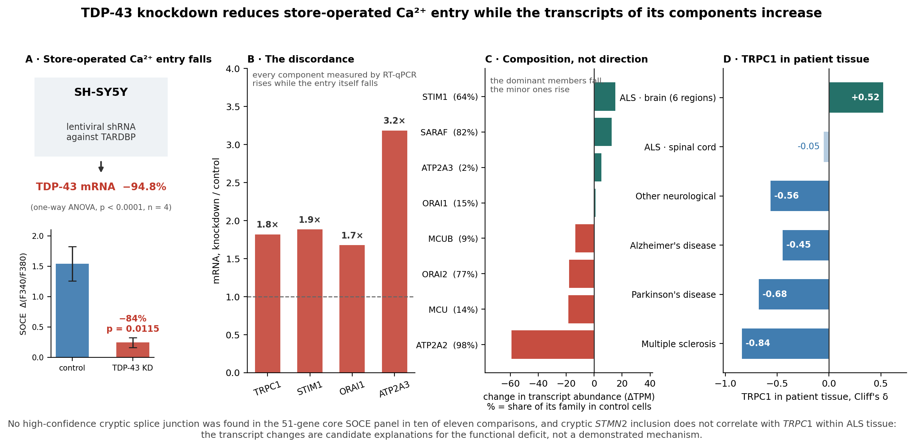

# TDP-43 knockdown and store-operated Ca²⁺ entry: analysis repository

Code, figures, tables, supplementary files and source data for the manuscript
*TDP-43 knockdown is associated with reduced store-operated Ca²⁺ entry and altered
calcium-regulatory RNA profiles in SH-SY5Y cells*.



*Every value in this summary is read from the files in this repository by
`code/fig_graphical_abstract.py`; it is not a figure of the manuscript.*

The current edited manuscript is `manuscript/MANUSCRIPT_NEUROCHEMISTRY_INTERNATIONAL_FINAL.docx`
(with matching `.md`). It has six main figures in `figures/main/` and eight
supplementary figures in `figures/supplementary/`. The complete editable supplement is
`supplementary/SUPPLEMENTARY_MATERIAL.docx`; the NCI highlights are in
`highlights_Neurochemistry_International.docx`.
The earlier nine-figure manuscript (`MANUSCRIPT_v4_SUBMISSION_REVIEWED`) and
its `figures/Figure1`–`Figure9` files remain as a historical version. The original
`MANUSCRIPT_v4_SUBMISSION.docx` is also retained.

The analyses grew out of the first author's doctoral thesis (Ege University, 2026). Five
analyses were revised for the manuscript; `CHANGES_FROM_THESIS.md` sets out what changed and
why. Where the thesis and this repository differ, this repository is current.

```
├── manuscript/           manuscript, Markdown and Word
├── figures/main/         current Figures 1–6, PNG (300 dpi or higher) and editable SVG
├── figures/supplementary/ current Supplementary Figures S1–S8
├── figures/Figure1–9    historical nine-figure layout
├── tables/               Tables 1–5, CSV in the current manuscript order
├── supplementary/        Supplementary Tables S1–S17
├── source_data/          intermediate data behind Tables 4–5 and Figures 6–8
├── code/                 analysis and figure scripts
├── logs/                 automated consistency check
├── CHANGES_FROM_THESIS.md
└── DATA_AVAILABILITY.md  accessions and externally hosted resources
```

## Current figures

| File | Purpose |
|---|---|
| `main/Figure1_functional_consequences` | laboratory RT-qPCR and 48-h WST-1 |
| `main/Figure2_calcium_responses` | original representative Fura-2 traces (A, B), ER-release and Ca²⁺-readdition amplitudes (C, D) and both recordings on common axes (E) |
| `main/Figure3_transcript_profile` | independent public SH-SY5Y transcript context |
| `main/Figure4_SOCE_splicing` | replicate-level PSI of the SOCE-machinery events, STIM2.1 exon meta-analysis and CBARP exon-4 junction usage |
| `main/Figure5_ALS_expression` | ALS brain/spinal-cord tissue expression |
| `main/Figure6_working_model` | conceptual model distinguishing measurements from hypotheses |
| `supplementary/Supplementary_Figure_S1`–`S8` | splicing, read-support checks, CBARP locus (S3), cryptic controls, NMD, APA and additional tissue comparisons |

All current main figures are provided as publication-resolution PNG files and editable SVG masters.
The laboratory did not measure splicing; Figure 4 and Supplementary Figure S3 use the public RNA-seq data.
Supplementary Figure S3 is drawn from the alignments: `code/cbarp_bam_extract.py` reads the
14 SH-SY5Y and iPSC-colony BAM files with the junction rules of Methods 2.5 and writes
`source_data/CBARP_locus/`; `code/fig_splicing_revision.py` draws Figures 4 and 6 and S3 from it.
Figure 2 retains the original representative Fura-2 traces and pairs them with the measured
ER-release and Ca²⁺-readdition amplitudes. The lower panels show the three independent cultures
per group and mean ± SEM; the two amplitudes are compared with Welch's t-test. Panel E
(`code/fig2_common_scale_panel.py`) replots the exported ratio values of the two representative
recordings (`source_data/fura2_traces/`) on common axes. WST-1 was measured at 48 h (n = 4 wells).

## Historical figures

| File | Manuscript | Content |
|---|---|---|
| `Figure1_detection_power` | Figure 1 | power in a 3 + 3 design |
| `Figure2_TRPC1_robustness` | Figure 2 | replicate-level failure of the TRPC1 call |
| `Figure3_robust_candidates` | Figure 3 | SOCE splicing candidates with bootstrap CIs |
| `Figure4_cryptic_discovery_and_NMD` | Figure 4 | cryptic discovery, Ca²⁺ panels, NMD interaction |
| `Figure5_specificity_and_APA` | Figure 5 | RBP specificity, corrected APA, STMN2 intron 2 coverage |
| `Figure6_functional_consequences` | Figure 6 | laboratory experiments (new in v4) |
| `Figure7_transcript_family_abundance` | Figure 7 | family abundance, TPM adjusted for library composition |
| `Figure8_TRPC1_disease_direction` | Figure 8 | TRPC1 across five diseases (all regions, donor-level MS) |
| `Figure9_NYGC_cryptic_STMN2` | Figure 9 | junction-level cryptic STMN2 in ALS tissue |
| `graphical_abstract` | NA | repository summary, not part of the manuscript |

Figure numbers are **not** burned into the images; the file name carries the number.

## Supplementary files

| File | Content |
|---|---|
| `S1_laboratory_source_data.xlsx` | raw Ct, relative expression, Fura-2 and WST-1 values per replicate, primers, thermal profile, summary statistics |
| `S2_calcium_gene_panels.csv` | the four cumulative Ca²⁺ panels |
| `S3_rMATS_significant_events.csv.gz` | every rMATS event at FDR < 0.05 and \|ΔPSI\| ≥ 0.10, JC and JCEC, six datasets, with event coordinates, form lengths and raw junction counts |
| `S4_matched_permutation_enrichment.csv` | enrichment against the covariate-matched null |
| `S5_high_confidence_cryptic_events.csv` | high-confidence unannotated splicing changes, all comparisons |
| `S6_cryptic_positive_controls.csv`, `S6b_positive_control_matrix.csv` | positive-control recovery in the human comparisons (the controls are not conserved in mouse) |
| `S7_SOCE_genes_annotation_free.csv` | SOCE genes in the junction-level analysis |
| `S8_cryptic_STMN2_ALS_vs_control.csv` | cryptic PSI by region, ALS versus control |
| `S9_cryptic_PSI_correlations_within_ALS.csv` | all 231 correlations within ALS samples |
| `S10_NMD_interaction_SOCE_panel.csv`, `S10b_NMD_panel_level_tests.csv` | four-condition NMD interaction and panel-level tests (recomputed in v4) |
| `S11_APA_candidate_gradients.csv` | depth-qualified coverage gradients after the `-j` correction, with the genomic windows of every unit |
| `S12_cryptic_counts_by_dataset.csv` | call counts per comparison with the RBP controls |
| `S13_STIM2_SOAR_exon_junction_level.csv` | SOAR exon at junction level |
| `S14_control_vs_control_null_test.csv` | split-control null test: permissive definition and three stricter tiers |
| `S15_STIM2.1_exon_six_datasets.csv` | STIM2.1 meta-analysis |
| `S16_multiple_sclerosis_both_cohorts.csv`, `S16b_multiple_sclerosis_donor_level.csv` | MS analysis; the donor-level re-analysis is new in v4 |
| `S17_dataset_accessions.csv` | every accession with design, library type, run-level groups for knockdown experiments and group definitions for patient cohorts |

A thesis-era supplementary table listing "cryptic-junction-positive and NMD-sensitive genes"
is not part of this set: it was built from the superseded eight-contrast NMD statistics
(`CHANGES_FROM_THESIS.md`, section 2), under which no gene passes genome-wide FDR.

## How to reproduce

For the current figure set, the laboratory source values are read by
`code/fig_main_lab.py` and `code/build_source_data.py`; the representative Fura-2
traces come from the original Prism export and are not numerically redrawn.
`code/fig_main_transcript_disease.py`, `code/fig_supp_splicing.py` and
`code/fig_supp_rna_processing.py` generate the RNA figures. The retained S1 and S2
figures are drawn by `code/fig_redesign_main.py`; S7 is drawn by
`code/fig_redesign_disease.py`. These scripts still use the original workstation
paths; see the note under Requirements before rerunning them elsewhere.

The commands below rebuild the historical nine-figure version and its tables.

```bash
/usr/bin/python3 code/build_family_abundance.py  # Table 4 source: composition-adjusted TPM
/usr/bin/python3 code/fig_v3_main.py        # Figures 1, 2, 3, 7
/usr/bin/python3 code/fig_v3_junction.py    # Figures 4, 5, 9
/usr/bin/python3 code/fig_v3_lab.py         # Figure 6
/usr/bin/python3 code/fig_v3_disease.py     # Figure 8
/usr/bin/python3 code/build_tables_v3.py    # Tables 1-5, S2, S4-S16
/usr/bin/python3 code/build_source_data.py  # S1
/usr/bin/python3 code/build_S3_rmats.py     # S3   (needs the rMATS output)
/usr/bin/python3 code/build_S17_datasets.py # S17
/usr/local/bin/Rscript  code/deseq_full.R   # DESeq2 on the complete transcript map
/usr/bin/python3 code/ms_donor_level.py     # donor-level MS analysis
/usr/bin/python3 code/build_manuscript_docx.py  # regenerates the original baseline manuscript, not the reviewed copy
/usr/bin/python3 code/qa_check_v4.py        # consistency check
```

## Requirements

Python 3.9 with the packages in `requirements.txt`; R 4.3 with DESeq2, FRASER, sva and
data.table, and R 4.4 for the isoform-usage packages (IsoformSwitchAnalyzeR, DRIMSeq,
stageR); the command-line tools and versions in `environment.yml`.

Two notes for anyone re-running the pipeline. The scripts carry absolute paths to the two
working roots used in this study and must be pointed at local copies first. The junction,
coverage and FRASER steps read the aligned BAM files, which are not redistributed here;
`DATA_AVAILABILITY.md` gives the accessions and the alignment parameters needed to rebuild
them.

## Licence

Code (`code/`): MIT licence, see `LICENSE`. Data, figures, tables and supplementary files:
CC BY 4.0, see `LICENSE-DATA.md`. The manuscript files are shared for transparency and are not
licensed for reuse until the article is published.
