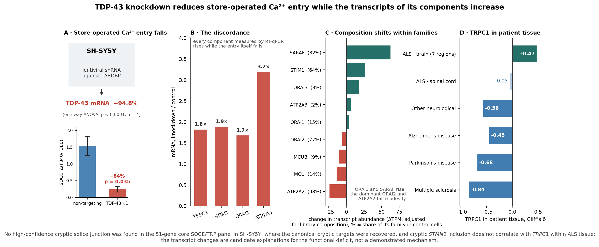

# TDP-43 knockdown and calcium-regulatory RNA candidates: analysis repository

Code, figures, tables, supplementary files and source data for the manuscript
*Calcium-regulatory RNA candidates after TDP-43 knockdown in SH-SY5Y cells: reanalysis of public
RNA-seq data and a single-plate Ca²⁺-readdition observation*.



*Two graphical abstracts, two roles. The detailed four-panel summary above
(`figures/graphical_abstract.*`, `code/fig_graphical_abstract.py`) is the summary of this repository; it is not sized
for the journal. The graphical abstract for the journal is the simplified `figures/graphical_abstract_journal.*`
(`code/fig_graphical_abstract_journal.py`): 5:2, 3900 × 1560 px at 300 dpi as PNG and TIFF, plus PDF and SVG, with
type large enough to stay legible when ScienceDirect scales it to 500 × 200 px. Neither is a numbered figure of the
manuscript and neither carries a result that is absent from the main text or the supplement. Every value in both is
read from the files in this repository; no regional effect is averaged and no diseases are ranked.*

The current edited manuscript is `manuscript/MANUSCRIPT_NEUROCHEMISTRY_INTERNATIONAL_FINAL.docx`
(with matching `.md`). It has six main figures in `figures/main/` and nine
supplementary figures in `figures/supplementary/`. The complete editable supplement is
`supplementary/SUPPLEMENTARY_MATERIAL.docx`; the NCI highlights are in
`highlights_Neurochemistry_International.docx`.
The earlier nine-figure manuscript (`MANUSCRIPT_v4_SUBMISSION_REVIEWED`) and
its `figures/Figure1`–`Figure9` files remain as a historical version. The original
`MANUSCRIPT_v4_SUBMISSION.docx` is also retained.

The analyses grew out of the first author's doctoral thesis (Ege University, 2026). Several
analyses were revised for the manuscript; `CHANGES_FROM_THESIS.md` sets out what changed and
why. Where the thesis and this repository differ, this repository is current.

```
├── manuscript/            manuscript, Markdown and Word (the v4 files are historical)
├── figures/main/          current Figures 1–6, PNG (300 dpi or higher) and editable SVG
├── figures/supplementary/ current Supplementary Figures S1–S9 (PNG, SVG, PDF)
├── figures/graphical_abstract.{png,pdf,svg}  detailed summary of the repository (not sized for the journal)
├── figures/graphical_abstract_journal.{png,tiff,pdf,svg}  graphical abstract for the journal (5:2)
├── figures/Figure1–9      historical nine-figure layout
├── tables/                Tables 1–5, CSV in the current manuscript order
├── supplementary/         Supplementary Tables S1–S18d, the editable supplement and its figure legends
├── source_data/           the data behind Tables 1 and 4–5, the DESeq2 runs, the power simulation (S1),
│                          the CBARP locus figure (S3), the svaseq comparison and the STIM1 isoform tests
├── code/                  analysis, figure and revision scripts
├── logs/                  automated consistency check
├── CHANGES_FROM_THESIS.md
├── CORRECTIONS_2026-09-29.md, QPCR_CORRECTION_2026-09-29.md, CORRECTIONS_2026-09-29_v1.0.8.md
└── DATA_AVAILABILITY.md   accessions and externally hosted resources
```

## Evidence levels

The manuscript, the supplement, the highlights and the graphical abstracts use the same wording for what each
kind of measurement can and cannot support.

| Evidence | Unit of replication | Statistics | Where |
|---|---|---|---|
| RT-qPCR (laboratory) | four biological replicates per group; one reference gene (*GAPDH*) | Welch tests on ΔCt, Holm adjustment | Figure 1; Supplementary Table S1 (workbook) |
| Fura-2 (laboratory) | three wells per group, one culture plate | descriptive only, not paired with the RT-qPCR | Figure 2; Supplementary Figure S9; Supplementary Table S1 |
| WST-1 (laboratory) | four wells, one experiment | descriptive only | Figure 1C; Supplementary Table S1 |
| Public RNA-seq, expression | three control and three knockdown libraries (GSE296712) | DESeq2, Benjamini–Hochberg | Figure 3; Table 1 |
| Public RNA-seq, splicing and junctions | six comparisons for rMATS, eleven for the annotation-free screen | rMATS FDR, replicate-level bootstrap, control-versus-control null | Figure 4; Tables 2–4; Supplementary Figures S1–S4, S6; Supplementary Tables S3–S7, S12–S15 |
| ALS and comparison tissue | samples and donors of the NYGC and four other cohorts, each region analysed separately | Cliff's δ, Benjamini–Hochberg within region; not adjusted for cell composition in Figure 5 | Figure 5; Table 5; Supplementary Figures S7 and S8; Supplementary Tables S8, S16–S18 |

The RNA analyses produce candidates. None of them is a confirmed explanation of the one-plate Fura-2 observation.

## Current figures

| File | Purpose |
|---|---|
| `main/Figure1_functional_consequences` | laboratory RT-qPCR (four biological replicates per group) and 48-h WST-1 (four wells) |
| `main/Figure2_calcium_responses` | Fura-2 in one culture plate: representative recordings on common axes (A), ER release, Ca²⁺ readdition and their ratio for the three wells per group (B–D); descriptive |
| `main/Figure3_transcript_profile` | calcium-regulatory transcript profile in the public SH-SY5Y RNA-seq comparison (adjusted TPM and DESeq2 fold changes) |
| `main/Figure4_SOCE_splicing` | replicate-level PSI of the four SOCE-related skipped-exon events, with the exon length in each title (A); the 24-nt STIM2 SOAR exon that gives STIM2.1, a different exon, in six datasets (B); *CBARP* exon-4 junction usage (C) |
| `main/Figure5_ALS_expression` | Cliff's δ of *TRPC1*, *SARAF* and *CBARP* in ALS tissue by region, with the numbers of cases and controls |
| `main/Figure6_working_model` | working model that keeps measurements and hypotheses apart |
| `supplementary/Supplementary_Figure_S1_detection_power` | example detection-power simulation (assumptions printed on the figure; not an estimate of rMATS power) |
| `supplementary/Supplementary_Figure_S2_TRPC1_robustness` | replicate-level assessment of a *TRPC1* skipped-exon call |
| `supplementary/Supplementary_Figure_S3_CBARP_locus` | *CBARP* exon 4–5 region: Sashimi plots from the alignments and rMATS ΔPSI of the *CBARP* events |
| `supplementary/Supplementary_Figure_S4_cryptic_controls` | positive controls and specificity of the annotation-free junction screen |
| `supplementary/Supplementary_Figure_S5_NMD_interaction` | descriptive TDP-43 × NMD-inhibition interactions |
| `supplementary/Supplementary_Figure_S6_APA_coverage` | coverage-based polyadenylation screen and the *STMN2* control |
| `supplementary/Supplementary_Figure_S7_cross_disease_TRPC1` | *TRPC1* across neurological comparison cohorts, with the multiple-sclerosis re-analyses separated |
| `supplementary/Supplementary_Figure_S8_STMN2_expression_vs_cryptic_PSI` | *STMN2* expression and cryptic junction inclusion in ALS tissue |
| `supplementary/Supplementary_Figure_S9_original_Fura2_recordings` | the two original Fura-2 recordings at their own axis ranges |

All current main figures are provided as publication-resolution PNG files and editable SVG masters.
The laboratory did not measure splicing; Figure 4 and Supplementary Figure S3 use the public RNA-seq data.
Supplementary Figure S3 is drawn from the alignments: `code/cbarp_bam_extract.py` reads the
14 SH-SY5Y and iPSC-colony BAM files with the junction rules of Methods 2.5 and writes
`source_data/CBARP_locus/`; `code/fig_splicing_revision.py` draws Figures 4 and 6 and S3 from it.
Figure 2 is drawn by `code/fig_revision_v122.py` from the raw GraphPad Prism exports of the two representative
recordings (`source_data/fura2_traces/PRISM_RAW_*_130626.txt`) and the well-level amplitudes of workbook S1;
the recordings are aligned to the steepest point of the Ca²⁺-readdition rise, and no plotted value is smoothed
or rescaled. Supplementary Figure S9 is the unchanged Prism export of the same two recordings
(`source_data/fura2_traces/Figure2_panels_A-D.png`). The comparisons of the lower panels are descriptive.
WST-1 was measured at 48 h (n = 4 wells).

## Historical figures

| File | Manuscript | Content |
|---|---|---|
| `Figure1_detection_power` | Figure 1 | power in a 3 + 3 design |
| `Figure2_TRPC1_robustness` | Figure 2 | replicate-level failure of the TRPC1 call |
| `Figure3_robust_candidates` | Figure 3 | SOCE splicing candidates with bootstrap CIs |
| `Figure4_cryptic_discovery_and_NMD` | Figure 4 | cryptic discovery, Ca²⁺ panels, NMD interaction |
| `Figure5_specificity_and_APA` | Figure 5 | RBP specificity, corrected APA, STMN2 intron 2 coverage |
| `Figure6_functional_consequences` | Figure 6 | laboratory experiments (new in v4) |
| `Figure7_transcript_family_abundance` | Figure 7 | family abundance, TPM adjusted for library composition |
| `Figure8_TRPC1_disease_direction` | Figure 8 | TRPC1 across five diseases (all regions, donor-level MS) |
| `Figure9_NYGC_cryptic_STMN2` | Figure 9 | junction-level cryptic STMN2 in ALS tissue |

Figure numbers are **not** burned into the images; the file name carries the number.

## Supplementary files

| File | Content |
|---|---|
| `S1_laboratory_source_data.xlsx` | raw Ct and relative expression, Fura-2 wells from one plate, WST-1 well values, primers, thermal profile and descriptive summaries |
| `S2_calcium_gene_panels.csv` | the four cumulative Ca²⁺ panels |
| `S3_rMATS_significant_events.csv.gz` | every rMATS event at FDR < 0.05 and \|ΔPSI\| ≥ 0.10, JC and JCEC, six datasets, with event coordinates, form lengths and raw junction counts |
| `S4_matched_permutation_enrichment.csv` | enrichment against the covariate-matched null |
| `S5_stringent_filter_unannotated_splicing_candidates.csv` | unannotated splicing changes that pass the stringent filter, all comparisons (a candidate list, not validated events) |
| `S6_cryptic_positive_controls.csv`, `S6b_positive_control_matrix.csv` | positive-control recovery in the human comparisons (the controls are not conserved in mouse) |
| `S7_SOCE_genes_annotation_free.csv` | SOCE-associated genes in the junction-level analysis |
| `S8_cryptic_STMN2_ALS_vs_control.csv` | cryptic PSI by region, ALS versus control |
| `S9_cryptic_PSI_correlations_within_ALS.csv` | all 231 correlations within ALS samples |
| `S10_NMD_interaction_SOCE_panel.csv`, `S10b_NMD_panel_descriptive_summary.csv` | descriptive NMD interactions and panel medians; no inferential tests |
| `S11_APA_candidate_gradients.csv` | depth-qualified coverage gradients after the `-j` correction, with the genomic windows of every unit |
| `S12_cryptic_counts_by_dataset.csv` | call counts per comparison with the RBP controls |
| `S13_STIM2_SOAR_exon_junction_level.csv` | SOAR exon at junction level |
| `S14_control_vs_control_null_test.csv` | split-control null test: permissive definition and three stricter tiers |
| `S15_STIM2.1_exon_six_datasets.csv` | STIM2.1 meta-analysis |
| `S16_multiple_sclerosis_both_cohorts.csv`, `S16b_multiple_sclerosis_donor_level.csv` | MS analysis; the donor-level re-analysis is new in v4 |
| `S17_dataset_accessions.csv` | every accession with design, library type, run-level groups for knockdown experiments and group definitions for patient cohorts |
| `S18_TRPC1_cell_composition_adjustment.csv`, `S18b_cryptic_STMN2_by_group_and_region.csv`, `S18c_cryptic_STMN2_within_comparison_group.csv`, `S18d_NYGC_donor_level_sensitivity.csv` | NYGC cell-marker adjustment and cryptic STMN2 comparison-group checks |
| `Supplementary_Figure_Legends.md`, `.docx` | the nine supplementary figure legends, copied from `SUPPLEMENTARY_MATERIAL.docx` by `code/build_supplementary_legends.py` |

A thesis-era supplementary table listing "cryptic-junction-positive and NMD-sensitive genes"
is not part of this set: it was built from the superseded eight-contrast NMD statistics
(`CHANGES_FROM_THESIS.md`, section 2), whose inferential p values have been withdrawn. Current NMD tables contain descriptive estimates only.

## Which counts feed which result

Two gene-level count sets exist for the primary SH-SY5Y comparison (GSE296712; three 0 ng/mL control and three
75 ng/mL knockdown libraries: SRR33374996, SRR33375001, SRR33374995 versus SRR33374999, SRR33374997,
SRR33375000). **Every DESeq2 statistic in the manuscript comes from the Salmon-based set**; the featureCounts run
is a cross-check.

| Result | Input | Script | Output |
|---|---|---|---|
| DESeq2 log2 fold changes and adjusted p values (text, Table 1, Figure 3B) | Salmon v1.11.4 estimated counts, summed to genes with the transcript-to-gene map of the *comprehensive* GENCODE v47 annotation (`source_data/gene_counts_full.csv`) | `code/deseq_full.R` | `source_data/DESeq2_ctrl_vs_75_fullmap.csv` |
| Adjusted TPM and family shares (Table 1, Figure 3A) | Salmon TPM summed with the same map (`source_data/gene_TPM_full.csv`) and the DESeq2 table above | `code/build_family_abundance.py` | `tables/Table1_transcript_family_abundance.csv`, `source_data/Table4_family_TPM.csv` |
| svaseq sensitivity (Results 3.2, Supplementary Results 5) | the same Salmon counts | `code/svaseq_sensitivity.R` | `source_data/svaseq_sensitivity_SHSY5Y.csv` |
| featureCounts cross-check (Methods 2.2) | featureCounts v2.1.1, `-s 0 -g gene_name` on the GENCODE v47 *basic* annotation, same six libraries; DESeq2 run copied from the July 2026 reanalysis | `code/compare_featurecounts_salmon.py` | `source_data/DESeq2_ctrl_vs_75_featureCounts.csv`, `source_data/DESeq2_featureCounts_vs_Salmon_calcium_genes.csv` |
| Transcript-level isoform tests of *STIM1* | Salmon transcript counts against the comprehensive index (384,354 transcripts) | IsoformSwitchAnalyzeR, DRIMSeq, stageR (R 4.4); the eligibility records by `code/audit_tables_v118.py`, the IsoformSwitchAnalyzeR/DEXSeq rows by `code/stim1_isoformswitch_extract.R` | `source_data/STIM1_transcript_test_eligibility.csv`, `source_data/STIM1_isoformswitch_DEXSeq.csv` |
| NMD interaction | GSE307054 gene counts and the authors' size factors | `code/audit_tables_v118.py` | `supplementary/S10*`, `source_data/nmd_descriptive_all_genes.csv.gz` |
| ALS and comparison tissue | recount3 gene and junction matrices for SRP270799; the four comparison cohorts | `code/build_tables_v3.py` (Table 5, S16), `code/nygc_composition_and_cryptic_s18.py` (S18–S18c), `code/nygc_donor_sensitivity_v118.py` (S18d), `code/ms_donor_level.py` | `tables/Table5_cross_disease_comparison.csv`, `supplementary/S16*`, `supplementary/S18*` |

The two runs agree closely on the calcium-regulatory genes (for example *STIM1* +0.91 versus +0.93, *TRPC1* +0.89
versus +0.96, *ORAI1* +0.42 versus +0.43, *ATP2A3* +1.32 versus +1.31) and the log2 fold changes of the 20,833 genes
counted in both correlate with Pearson r = 0.85. *STMN2* is the one gene of that list on which they differ markedly;
the manuscript quotes no gene-level DESeq2 value for *STMN2*, whose cryptic splicing is measured at junction level.

The summation of the Salmon `quant.sf` files to genes with the complete map was run in the working directory and is
not scripted in this repository; the aggregated tables `gene_counts_full.csv` and `gene_TPM_full.csv` are supplied and
everything downstream of them is scripted. The map of the basic annotation covers only 157,588 of the 384,354
transcripts of the index and would discard 26% of the TPM, so it is not used for any gene-level summary.

## How to reproduce

The current figure set is drawn by these scripts, all reading files of this repository (the laboratory values
come from workbook S1, the tissue values from `tables/` and `supplementary/`):

| Script | Draws |
|---|---|
| `code/fig_lab_descriptive_v118.py` | Figure 1 |
| `code/fig_revision_v122.py` | Figure 2, Figure 5, Supplementary Figures S1, S7 and S9 |
| `code/fig_main_transcript_disease.py` | the transcript-profile figure (Figure 3); the script still writes under the numbering of the earlier four-figure layout (`Figure2_transcript_profile`) to an earlier working folder, and its ALS panel is superseded by `fig_revision_v122.py` |
| `code/fig_splicing_revision.py` | Figures 4 and 6, Supplementary Figure S3 (`python code/fig_splicing_revision.py 4 6` redraws the two main figures) |
| `code/fig_supp_rna_processing.py` | Supplementary Figures S4, S6 and S8 |
| `code/fig_nmd_descriptive_v118.py` | Supplementary Figure S5 |
| `code/fig_redesign_main.py` | Supplementary Figure S2 |
| `code/fig_graphical_abstract.py` | the detailed graphical abstract (repository summary) |
| `code/fig_graphical_abstract_journal.py` | the simplified graphical abstract for the journal |

`code/relabel_s1_qpcr_v118.mjs` maintains the source workbook's biological-replicate qPCR labels and summaries.
The scripts still use the original workstation paths in several places; see the note under Requirements
before rerunning them elsewhere.

The commands below rebuild the historical nine-figure version and its tables.

```bash
/usr/bin/python3 code/build_family_abundance.py  # Table 1 source: composition-adjusted TPM
/usr/bin/python3 code/fig_v3_main.py        # historical Figures 1, 2, 3, 7
/usr/bin/python3 code/fig_v3_junction.py    # historical Figures 4, 5, 9
/usr/bin/python3 code/fig_v3_lab.py         # historical Figure 6
/usr/bin/python3 code/fig_v3_disease.py     # historical Figure 8
/usr/bin/python3 code/build_tables_v3.py    # Tables 1-5, S2, S4-S16
/usr/bin/python3 code/build_source_data.py  # S1
/usr/bin/python3 code/build_S3_rmats.py     # S3   (needs the rMATS output)
/usr/bin/python3 code/build_S17_datasets.py # S17
/usr/local/bin/Rscript  code/deseq_full.R   # DESeq2 on the complete transcript map (run from source_data/)
/usr/bin/python3 code/ms_donor_level.py     # donor-level MS analysis
/usr/bin/python3 code/build_manuscript_docx.py  # regenerates the original baseline manuscript, not the reviewed copy
/usr/bin/python3 code/qa_check_v4.py        # consistency check
```

## Requirements

Python 3.9 with the packages in `requirements.txt`; R 4.3 with DESeq2, FRASER, sva and
data.table, and R 4.4 for the isoform-usage packages (IsoformSwitchAnalyzeR, DRIMSeq,
stageR); the command-line tools and versions in `environment.yml`.

Two notes for anyone re-running the pipeline. The scripts carry absolute paths to the two
working roots used in this study (`~/Desktop/MAKALE` for outputs, `~/Desktop/TEZ` and an external drive for
inputs) and must be pointed at local copies first; scripts that run from the repository root and read only
files of this repository (for example `code/compare_featurecounts_salmon.py`, `code/svaseq_sensitivity.R`,
`code/build_supplementary_legends.py` and `code/qa_check_v4.py`) need no edit. The junction, coverage and FRASER
steps read the aligned BAM files, which are not redistributed here; `DATA_AVAILABILITY.md` gives the accessions
and the alignment parameters needed to rebuild them.

## Licence

Code (`code/`): MIT licence, see `LICENSE`. Data, figures, tables and supplementary files:
CC BY 4.0, see `LICENSE-DATA.md`. The manuscript files are shared for transparency and are not
licensed for reuse until the article is published.

## Corrections and current rebuild order

Release v1.0.7 introduced the scientific audit corrections described in
`CORRECTIONS_2026-09-29.md`, with the qPCR correction in `QPCR_CORRECTION_2026-09-29.md`. RT-qPCR has four biological replicates per group,
Fura-2 three wells per group on one plate, and the available WST-1 values four
wells from one experiment. RT-qPCR uses two-sided Welch tests on Delta Ct with Holm adjustment. Fura-2 and WST-1 are descriptive. Public RNA-seq experiments retain their own biological designs.

Release v1.0.8 narrows the claim to the evidence level, renames and re-describes several analyses,
redraws Figures 2, 4, 5 and 6 and the graphical abstract, and adds Supplementary Figure S9; the changes are listed in
`CORRECTIONS_2026-09-29_v1.0.8.md`.

Current analysis/figure entrypoints (with the workstation input paths configured), in order:

1. `python code/audit_tables_v118.py`: S13, descriptive S10/S10b, full NMD source table,
   and all nine STIM1 transcript-test eligibility records.
2. `python code/nygc_donor_sensitivity_v118.py`: S18d donor sensitivity; also reproduces
   S18/S18b/S18c through the shared normalization module.
3. `python code/qpcr_biological_replicates_v121.py` then `node code/relabel_s1_qpcr_v118.mjs`: preserve S1 measurements and update experimental units.
4. `python code/fig_lab_descriptive_v118.py` and `python code/fig_nmd_descriptive_v118.py`:
   Figure 1 and Supplementary Figure S5.
5. `python code/revise_terminology_v122.py`: the renamed columns and labels of Table 4, S12, S14 and S5 (already applied; kept as a record).
6. `python code/fig_revision_v122.py`, `python code/fig_splicing_revision.py 4 6`, `python code/fig_supp_rna_processing.py`
   and `python code/fig_graphical_abstract.py`: the redrawn figures of v1.0.8; `python code/fig_graphical_abstract_journal.py`
   then draws the journal graphical abstract.
7. `python code/revise_manuscript_v122.py`: edits the reviewed DOCX files of v1.0.7 into v1.0.8 (each replacement must find its
   text exactly once; it refuses to run on a file that is not in the v1.0.7 state) and `python code/build_supplementary_legends.py`
   copies the supplementary captions into the stand-alone legend files.
8. `python code/export_manuscript_md.py`, `python code/qa_check_v4.py` and
   `python code/qa_audit_v118.py`: export and verify the edited manuscript and supporting files.

`recalc_nmd_shared_control.R` now delegates to the descriptive builder. Old editing
scripts and the historical nine-figure sources record earlier revisions; do not use
them to overwrite the current reviewed DOCX. S18d corrects across regions within
group/gene/model, whereas Table 5 corrects across genes within region.
