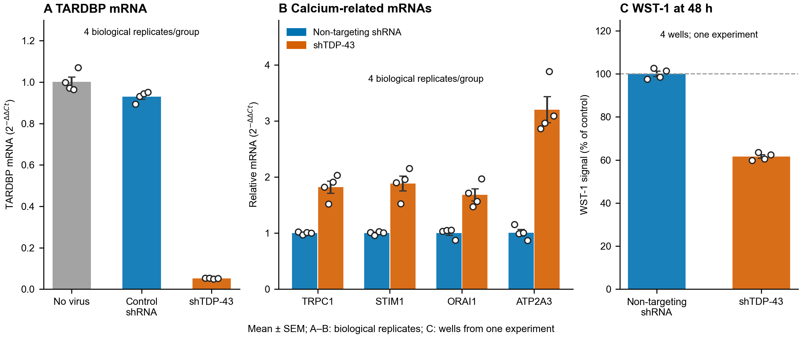
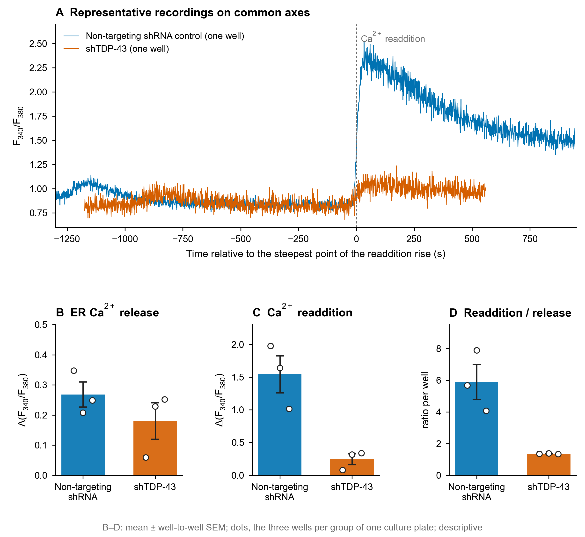
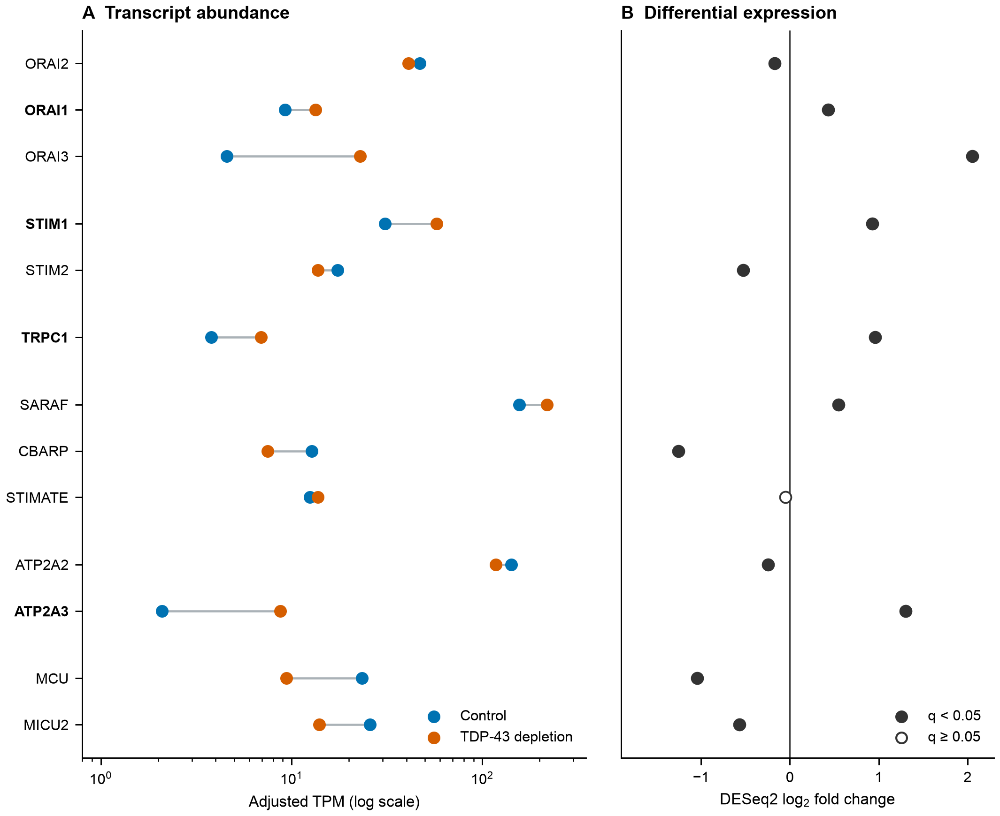
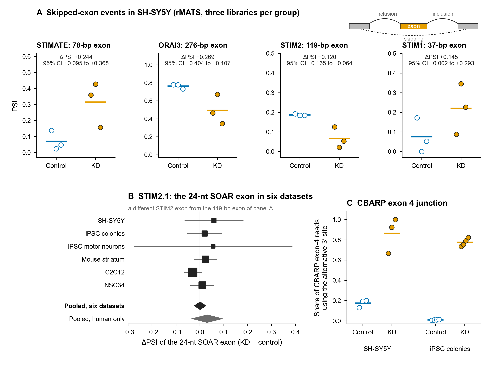
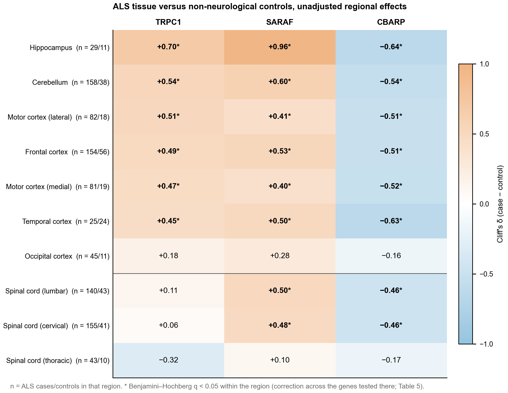
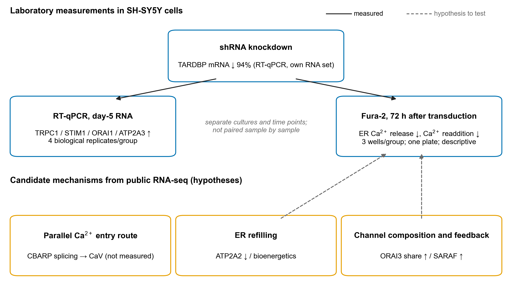

# **Calcium-regulatory RNA candidates after TDP-43 knockdown in SH-SY5Y cells: reanalysis of public RNA-seq data and a single-plate Ca²⁺-readdition observation**

**Elmasnur Yılmazᵃ, Yasemin Eraçᵃ,\***

ᵃ Department of Pharmacology, Faculty of Pharmacy, Ege University,
Erzene Mahallesi, Ankara Caddesi No: 172/98, 35040 Bornova, İzmir,
Türkiye

\* Corresponding author: Yasemin Eraç, yasemin.erac@ege.edu.tr

## **Abstract**

TDP-43 loss is implicated in amyotrophic lateral sclerosis (ALS), but
its relationship to store-operated Ca²⁺ entry (SOCE) is unclear. After
shRNA-mediated *TARDBP* depletion in SH-SY5Y cells, *TRPC1*, *STIM1*,
*ORAI1* and *ATP2A3* mRNA measurements were 1.7- to 3.2-fold higher
(four biological RT-qPCR replicates per group). In one Fura-2 culture
plate (three wells per group; descriptive), the Ca²⁺-readdition
amplitude was 84% lower in knockdown wells, ER Ca²⁺ release 33% lower
and the readdition-to-release ratio 77% lower; this observation
motivated the RNA analyses but was not paired with the RT-qPCR or
RNA-seq samples. The 48-h WST-1 signal was 38.5% lower (four wells, one
experiment; descriptive). We reanalysed six public TDP-43-depletion
RNA-seq comparisons (38 libraries) for calcium-regulatory expression and
splicing, screened eleven comparisons for unannotated junction changes,
and examined alternative polyadenylation and nonsense-mediated decay
descriptively. *CBARP* was the most reproducible splicing candidate
across species, whereas *STIM2*, *STIMATE* and *ORAI3* events were
supported in the primary RNA-seq model. No confirmed RNA-processing
event in the core SOCE-pathway genes explained the Fura-2 difference. In
ALS tissue, *TRPC1* and *SARAF* increased and *CBARP* decreased in six
brain regions, and *SARAF* and *CBARP* changed in the same direction in
cervical and lumbar cord, but these tissue associations could not be
attributed to TDP-43 loss. The RNA analyses identify candidate
calcium-regulatory changes without establishing a causal link to the
Fura-2 response, which requires independent biological replication.

**Keywords:** TDP-43; store-operated Ca²⁺ entry; calcium homeostasis;
alternative splicing; CBARP; SARAF; amyotrophic lateral sclerosis

## **1. Introduction**

TAR DNA-binding protein 43 (TDP-43, encoded by *TARDBP*) is a
ubiquitously expressed RNA-binding protein that governs splicing,
transcript stability and transport. Nuclear clearance with cytoplasmic
accumulation of TDP-43 is found in approximately 97% of amyotrophic
lateral sclerosis (ALS) cases and about half of frontotemporal lobar
degeneration cases (Neumann et al., 2006; Arai et al., 2006; Ling et
al., 2013), and in limbic-predominant age-related TDP-43 encephalopathy
(Nelson et al., 2019), making TDP-43 dysfunction one of the few
molecular events shared across otherwise distinct neurodegenerative
syndromes.

The principal consequence of nuclear TDP-43 loss is failure to repress
cryptic splicing. The best-characterised targets, *STMN2* and *UNC13A*
(Ling et al., 2015; Klim et al., 2019; Melamed et al., 2019; Brown et
al., 2022; Ma et al., 2022), are now the basis of antisense
oligonucleotide strategies (Baughn et al., 2023; Keuss et al., 2024),
establishing that TDP-43-dependent mis-splicing is both measurable and,
in principle, correctable. This has motivated systematic searches for
further TDP-43-dependent RNA processing events with functional
consequences.

Disturbed intracellular Ca²⁺ homeostasis is a longstanding feature of
ALS. Vulnerable motor neurons are notable for low cytosolic
Ca²⁺-buffering capacity (Grosskreutz et al., 2010), and Ca²⁺-dependent
excitotoxicity, mitochondrial dysfunction and endoplasmic reticulum (ER)
stress have all been implicated. Store-operated Ca²⁺ entry (SOCE), the
STIM1/ORAI-mediated influx triggered by ER store depletion (Putney,
2010; Prakriya and Lewis, 2015), with contributions from canonical
transient receptor potential (TRPC) channels (Ambudkar et al., 2007), is
a principal route of Ca²⁺ entry in non-excitable and many excitable
cells, and in a human neuroblastoma cell line it depends on TRPC1
(Selvaraj et al., 2012). STIMATE promotes the conformational switch that
activates STIM1 (Jing et al., 2015); ORAI2 and ORAI3 can form heteromers
with ORAI1 and restrain SOCE (Vaeth et al., 2017; Yoast et al., 2020),
and SARAF facilitates slow Ca²⁺-dependent inactivation of SOCE (Palty et
al., 2012) and, in SH-SY5Y cells, restrains store-independent
arachidonate-regulated Ca²⁺ entry (Albarran et al., 2016).
Disease-associated TDP-43 has been reported to disrupt VAPB–PTPIP51
tethering and thereby ER–mitochondrial Ca²⁺ transfer (Stoica et al.,
2014), but whether TDP-43 loss affects the SOCE pathway itself, and
whether it does so through RNA processing, has not been examined
systematically.

We first measured the Ca²⁺-readdition response of a
store-depletion–readdition protocol, and target mRNAs, in separate
SH-SY5Y cultures after shRNA-mediated TDP-43 depletion; the Fura-2
observation comes from a single culture plate and served to motivate the
RNA analyses, not to establish a phenotype. We then used public RNA-seq
datasets to examine calcium-regulatory transcript abundance and the
three routes by which TDP-43 loss is known to change RNA processing:
annotated and cryptic splicing, alternative polyadenylation, which
generates the truncated *STMN2* transcript, and coupling to
nonsense-mediated decay. Read-support and robustness checks are applied
throughout to the splicing results. Finally, we asked how the candidate
transcripts behave in ALS brain and selected neurological comparison
cohorts.

## **2. Materials and Methods**

### **2.1 Public RNA-seq datasets**

Six comparisons with paired controls and publicly available raw reads
were selected for the expression and event-level splicing analyses:
SH-SY5Y (GSE296712), induced pluripotent stem cell (iPSC) colonies
(GSE230647, bulk CTRL KD/TDP-43 KD arm, 4 + 4 libraries; Hruska-Plochan
et al., 2024), iPSC-derived motor neurons (GSE77702; Kapeli et al.,
2016), mouse striatum (GSE27394/GSE27218; Polymenidou et al., 2011), and
mouse C2C12 and NSC34 (GSE171714/SRP314028; Šušnjar et al., 2022),
comprising 38 libraries in total and counting the pooled technical
fragments of GSE27394 as one library per biological replicate. Two
further comparisons, K562 total RNA and poly(A)+ mRNA (ENCODE
ENCSR372DZW/ENCSR455TNF and ENCSR129RWD/ENCSR134JRE; Van Nostrand et
al., 2020), were added for the annotation-free junction analysis only
(Section 2.5) and were not processed with rMATS or DESeq2. Inclusion
required a condition reducing *TARDBP* expression or TDP-43 protein, at
least two biological replicates and open raw reads, and for the human
datasets the ability to evaluate *STMN2* and *UNC13A* as positive
controls. TDP-43-repressed cryptic exons are largely not conserved
between species (Ling et al., 2015), and the *STMN2* and *UNC13A* events
are absent from the mouse genes (Melamed et al., 2019; Ma et al., 2022),
so the mouse comparisons have no equivalent literature positive control.
GSE296712, a subseries of the dataset reported by Bryce-Smith et
al. (2025), was designated the primary human model because the
laboratory experiments use the same cell line.

Reads were downloaded with NCBI SRA Toolkit v3.2.1 (NCBI, 2025),
quality-assessed with FastQC v0.12.1 (Andrews, 2010), trimmed with Trim
Galore v0.6.11 (Cutadapt v5.2, Martin, 2011; Illumina TruSeq adapter
auto-detected, Phred Q20, minimum length 20 bases) and aligned with
HISAT2 v2.2.2 (Kim et al., 2019) in `--dta` mode with a
known-splice-site file, to the GRCh38 primary assembly or, for mouse
data, to the mm10 index distributed with HISAT2. GENCODE v47 (basic
annotation) and vM25 (Frankish et al., 2019) were used for read counting
and for junction annotation. The transcript-level quantification of
Section 2.4 uses the comprehensive GENCODE v47 annotation. Alignments
were sorted and indexed with SAMtools v1.23 (Danecek et al., 2021) and
summarised with MultiQC v1.25.1 (Ewels et al., 2016). The junction and
coverage analyses of Sections 2.5 and 2.7 were run with SAMtools v1.21.
Library strandedness was determined per dataset and rMATS was re-run
accordingly (fr-secondstrand for SH-SY5Y; fr-firststrand for iPSC
colony, iPSC-MN and mouse single-end).

The public SH-SY5Y subseries used a doxycycline-inducible knockdown
assessed after approximately 10 days of induction; it is distinct from
the constitutive shRNA cultures used for the laboratory assays.

For GSE27394, two technical sequencing fragments (SRR107072, SRR107073)
showed lower alignment rates; these are fragments of the same biological
replicate and counts were pooled within biological replicates, yielding
four control and four knockdown replicates.

### **2.2 Differential expression**

Differential expression was analysed on gene-level counts. For the
primary SH-SY5Y comparison (GSE296712; 0 versus 75 ng/mL doxycycline,
three libraries per group), every DESeq2 statistic reported here was
computed on Salmon estimated counts summed to genes with the complete
transcript-to-gene map (Section 2.4). A count of the same six libraries
with featureCounts v2.1.1 (Liao et al., 2014) at meta-feature level
against the GENCODE v47 basic annotation (`-s 0 -g gene_name`, with
`-p --countReadPairs` for paired-end libraries; multi-mapping and
multi-overlapping reads not counted) gave similar log2 fold changes
(Pearson r = 0.85 across the 20,833 genes counted in both). Counts were
modelled with DESeq2 v1.42.1 (Love et al., 2014), with
Benjamini–Hochberg correction (Benjamini and Hochberg, 1995). Genes with
p_adj \< 0.05 and \|log2FC\| ≥ 1 were called differentially expressed.
Sensitivity to unmodelled variation was assessed with svaseq (sva
v3.50.0; Leek, 2014), which estimated two surrogate variables in the
primary SH-SY5Y comparison; the refit with these variables is reported
in Section 3.2 and Supplementary Results 5.

### **2.3 Alternative splicing and robustness assessment**

Splicing was quantified with rMATS Turbo v4.3.0 (Shen et al., 2014) with
`--novelSS` for skipped exons, alternative 5′ and 3′ splice sites,
mutually exclusive exons and retained introns, using both junction-count
(JC) and junction+exon-body (JCEC) models. Events were called at a false
discovery rate (FDR) \< 0.05 with an absolute change in percent spliced
in (\|ΔPSI\|) ≥ 0.10.

Because rMATS applies FDR correction across all events irrespective of
read support, we additionally applied a coverage pre-filter **before**
correction, retaining events with ≥ 10 informative reads per sample on
average and ≥ 5 informative reads in every sample, and recomputing
Benjamini–Hochberg q-values within the filtered set. For the *TRPC1*
event of Section 3.3, and for the events that met the thresholds and the
coverage criteria in the twelve core SOCE-pathway genes (*STIM1*,
*STIM2*, *STIMATE*, *SARAF*, *CRACR2A*, *CRACR2B*, *ORAI1–3*, *TRPC1*,
*ATP2A2* and *ATP2A3*), we further computed (i) per-replicate PSI from
raw inclusion and skipping junction counts (IJC/SJC), (ii)
replicate-level bootstrap 95% confidence intervals for ΔPSI (20,000
resamples for the *TRPC1* analysis of Section 3.3; 10,000 for the SOCE
candidate events of Section 3.4), and (iii) leave-one-out ΔPSI, removing
each replicate in turn. Group assignment (b1 = knockdown, b2 = control)
was verified from the labelled group files of GSE27394. Exon coordinates
taken from rMATS output are reported here as 1-based, inclusive
intervals. For the 24-nucleotide *STIM2* exon whose inclusion produces
STIM2.1 (Section 3.5), the rMATS ΔPSI of the six datasets were combined
by fixed-effect inverse-variance meta-analysis; the variance of each
estimate was the between-replicate variance of PSI divided by the number
of replicates, summed over the two groups; heterogeneity was assessed
with Cochran’s Q and I² (Supplementary Table S15).

For Supplementary Figure S1, detection power was simulated for a 3 + 3
design at fixed depths of 10, 20, 50 and 100 informative reads per
sample: replicate PSI was drawn from a normal distribution around 0.5 ±
ΔPSI/2 (standard deviation 0.05, limited to 0.01–0.99), reads were
sampled binomially, groups were compared with a two-sample t test at
nominal p \< 0.05, and each condition was simulated 2,000 times. The
simulation does not reproduce the rMATS model, its FDR correction or its
\|ΔPSI\| threshold.

### **2.4 Isoform usage**

Transcript-level quantification used Salmon v1.11.4 (Patro et al., 2017)
against an index built from the comprehensive GENCODE v47 transcript set
(384,354 transcripts). Transcript estimates were aggregated to genes
with the transcript-to-gene map of the same comprehensive annotation.
The map of the basic annotation covers only 157,588 of those transcripts
and would discard 26% of the transcripts per million at the aggregation
step, so it was not used for any gene-level summary. Differential
isoform usage was assessed with IsoformSwitchAnalyzeR v2.6.0
(Vitting-Seerup and Sandelin, 2019), DRIMSeq v1.34.0 (Nowicka and
Robinson, 2016) and stageR v1.28.0 (Van den Berge et al., 2017),
including prediction of open reading frames, premature termination
codons, sensitivity to nonsense-mediated decay (NMD) and protein-domain
consequences. DRIMSeq gene-level q values describe the screening stage,
and stageR supplies transcript-level confirmation. Features with missing
DRIMSeq p values are not eligible for confirmation. Separate
IsoformSwitchAnalyzeR/DEXSeq isoform-usage results are identified as
such and are not stageR confirmation values. As an
annotation-independent comparison, LeafCutter v0.2.9 (Li et al., 2018)
was run on the same alignments, and SUPPA2 v2.3 (Trincado et al., 2018)
was run on the three control and three 75 ng/mL libraries as a check of
method concordance.

### **2.5 Annotation-free junction-level analysis**

Splice junctions were extracted directly from the alignments in two
independent ways, to assess sensitivity to the extraction rules. The
first set was produced with regtools v1.0.0 (Cotto et al., 2023;
`junctions extract -s XS -a 8 -m 50 -M 1000000`). The second was
produced with an in-house extractor that parses N operations from the
CIGAR string and additionally requires a mapping quality (MAPQ) ≥ 30,
primary non-duplicate alignment, an 8 bp matched anchor on both sides,
and an intron length between 50 and 500,000 bp. Junctions are reported
as 1-based, intron-inclusive intervals. On the primary SH-SY5Y
comparison the two raw sets share 217,550 junctions, counted before
strand-independent merging and before the read-support filters below;
the sets differ in size because regtools applies no mapping-quality
threshold and admits longer introns. All eleven comparisons were run on
the regtools set; the SH-SY5Y comparison was run on both, and
concordance of direction and significance is reported separately.

Junctions were classified against GENCODE v47 (human) or vM25 (mouse) as
annotated, novel combination (both splice sites annotated, the junction
not), novel site (one site unannotated), or fully novel. Local splicing
variations (LSVs) were defined by shared donor and by shared acceptor,
and the share of an LSV’s reads carried by each junction defined its
percent-spliced-in (Vaquero-Garcia et al., 2016). Differences between
groups were tested with a beta-binomial likelihood-ratio test using a
dataset-wide overdispersion parameter chosen by profile likelihood, with
Benjamini–Hochberg correction across all tested junctions, and
replicate-level bootstrap 95% confidence intervals (2,000 resamples). An
LSV required at least 20 reads per sample on average and non-zero
coverage in every sample; a junction required at least 5 reads in at
least one sample.

The calling threshold was calibrated against a control-versus-control
null: in datasets with four control replicates, the controls were split
2 + 2, the analysis repeated unchanged, and every call counted as a
false positive. The permissive definition required an unannotated
junction, ΔPSI ≥ 0.05, q \< 0.05, control PSI ≤ 0.05 and a bootstrap
lower bound above zero (Supplementary Table S14). Because this
definition produced about as many split-control calls as real calls, or
more (Section 3.5), we adopted an effect-based definition: a
**stringent-filter unannotated splicing candidate** requires a novel
splice site, ΔPSI ≥ 0.20, q \< 0.05, a bootstrap lower bound above 0.05,
at least 20 reads in the knockdown group, and non-zero counts in every
knockdown replicate. The name describes the filter and does not imply
validated specificity. A requirement of zero counts in controls was
deliberately not imposed, because it removes genuinely cryptic exons
with basal leakiness, *STMN2* among them. Positive-control recovery, not
call count, is used throughout as the measure of whether an analysis
detects known targets; because the sixteen literature controls are human
cryptic events, this check is available only for the human comparisons.

Eleven comparisons were analysed: SH-SY5Y at 75 and at 25 ng/mL
doxycycline, iPSC colonies, iPSC-derived motor neurons with TDP-43, FUS
or TAF15 knockdown, K562 total RNA and poly(A)+ mRNA, C2C12, NSC34, and
mouse striatum. For mouse striatum, technical sequencing fragments were
pooled within biological replicates, giving four per group.

### **2.6 Aberrant splicing outlier detection**

FRASER v1.14.1 (Mertes et al., 2021) was run on the nine-sample SH-SY5Y
doxycycline series (0, 25 and 75 ng/mL), counting split and non-split
reads from the alignments and modelling ψ5, ψ3 and splicing efficiency
θ. The method treats aberrant splicing as a rare deviation from a cohort
norm, whereas two thirds of this cohort are depleted samples; the run is
therefore treated as a limit of the approach (Supplementary Results 1).

### **2.7 Alternative polyadenylation**

Alternative and cryptic polyadenylation (APA) were assessed from
coverage rather than from junctions. Windows were built for 696 genes:
those of the 732-gene expanded Ca²⁺ panel for which annotated introns
and terminal exons could be retrieved, together with the cryptic
positive controls. Introns were taken as the gaps between the merged
exons of all basic-annotation transcripts of a gene and numbered in the
direction of transcription; these unit numbers need not match canonical
intron numbers (the *STMN2* unit ‘intron 2’, for example, corresponds to
the canonical intron 1, which contains cryptic exon 2a), and the genomic
windows of every reported unit are listed in Supplementary Table S11.
Two 500 bp windows were placed at the 5′ and 3′ ends of every such
intron of at least 1,200 bp (50 bp buffer from each splice site), and
the terminal exon of each gene of at least 400 bp was split into
proximal and distal halves, both in the direction of transcription. An
exon missing from the basic annotation that lies inside a window adds to
that window’s coverage, so a unit containing an alternatively spliced
exon also reports that exon’s inclusion. Depth was summed with
`samtools bedcov` (MAPQ ≥ 30) while excluding CIGAR reference skips and
deletions with `-j`. Equivalent windows were built for 687 orthologous
mouse genes. The analysis was run in the four knockdown comparisons
whose alignments were available: SH-SY5Y, iPSC-derived motor neurons,
C2C12 and NSC34; results are reported only for units whose input windows
passed the depth filter.

The **intronic polyadenylation index** is the 5′ window’s share of the
two intronic windows. Premature termination within an intron raises the
5′ window relative to the 3′ window; uniform intron retention raises
coverage in both windows and may leave the index largely unchanged, so
the index responds to a coverage gradient rather than to retention. The
**distal 3′ untranslated region (3′UTR) usage index** is the distal
half’s share of the terminal exon, following the logic of DaPars (Xia et
al., 2014). Both indices are reported as point estimates with bootstrap
intervals obtained by complete enumeration of the replicate combinations
rather than by sampling: 3⁶ = 729 combinations for the
three-versus-three comparisons and 2⁴ = 16 for the two-versus-two
iPSC-derived motor neurons, where the interval is correspondingly
coarse. No p or q values are produced. A unit was retained only if, in
every sample, the mean per-base depths of its two windows summed to at
least 3.

### **2.8 Nonsense-mediated decay inhibition**

Gene-level counts were obtained from GSE307054, the dataset of a
preprint (Sinha et al., 2025; i3Neurons; TDP-43 knockdown crossed with
knockdown of *XRN1*, *UPF1* and *SMG6* in four combinations, two
replicates each) and normalised with the authors’ size factors.
Sequencing batch is confounded with TDP-43 status in that design, so the
interaction was summarised as a difference of within-batch differences
for each of the four NMD-inhibition conditions. These contrasts share
the same baseline libraries and are not independent biological
replicates. We report point estimates descriptively, without inferential
p or q values. The contrast definition and gene filter are given in
Supplementary Results 2, and the results are treated as exploratory
throughout.

### **2.9 Ca²⁺ gene panels and enrichment testing**

Four cumulative gene panels were assembled from curated SOCE/TRP
components (n = 51), channels and transport systems (n = 117), curated
Ca²⁺-handling genes (n = 258) and an expanded Ca²⁺-associated set from
KEGG and Gene Ontology (n = 732; Supplementary Table S2). Symbols were
harmonised to HGNC/MGI and orthology verified via Ensembl Compara. Where
results are summarised for the nineteen-gene SOCE-associated set, this
refers to a fixed list: *STIM1*, *STIM2*, *ORAI1–3*, *TRPC1*, *SARAF*,
*STIMATE*, *CBARP*, *CRACR2A*, *CRACR2B*, *SELENOK*, *ATP2A1–3*, *MCU*,
*MCUB*, *MICU1* and *MICU2*; the core SOCE/TRP panel is Tier 1. The list
combines core STIM–ORAI components with store-refilling,
mitochondrial-uptake and voltage-gated-channel-associated genes (for
example *ATP2A1–3*, *MCU* and *CBARP*). *CBARP* was included in this
fixed list for the subsequent cross-dataset event ranking. The twelve
genes examined event by event in Section 2.3 (*STIM1*, *STIM2*,
*STIMATE*, *SARAF*, *CRACR2A*, *CRACR2B*, *ORAI1–3*, *TRPC1*, *ATP2A2*
and *ATP2A3*) are a subset of these nineteen and are called the core
SOCE-pathway genes.

Enrichment of significant splicing events within panels was tested both
by hypergeometric test against all testable genes and against a
**covariate-matched empirical null**: for each panel gene, the 25
nearest background genes in the space of log event count (a proxy for
gene length and testability) and log total read support (a proxy for
expression) were identified, and 5,000 permutations were drawn from
these matched pools. The matched permutation p-value is reported as the
primary result, because detection power for splicing events scales with
gene length and expression and Ca²⁺ channel genes lie at the extreme of
both distributions. Neither p value is corrected across the 24
combinations of dataset and panel.

### **2.10 Transcript-family abundance**

Transcripts per million (TPM) from Salmon were summed to gene level for
the primary SH-SY5Y comparison (0 vs 75 ng/mL doxycycline, n = 3 + 3),
so that members of a family are compared on a length-corrected scale.
TPM sums to the same total in every library, so a large gain by a few
abundant transcripts lowers the TPM of every other gene: in the
knockdown libraries *CHGA* rose from 1,857 to 10,675 TPM and
ribosomal-protein and mitochondrially encoded transcripts also took a
larger share, so that the median gene expressed in both groups (mean TPM
\> 5) had 24% lower TPM than in controls. Before conditions were
compared, each library’s TPM was therefore divided by a median-of-ratios
factor computed over the 13,907 genes with TPM \> 1 in all six
libraries, the normalisation principle of DESeq2; after this adjustment
gene-level changes agreed with the DESeq2 fold changes (median
difference −0.02 log2 units). For each functional family (STIM, ORAI,
sarco/endoplasmic reticulum Ca²⁺-ATPase \[SERCA\], TRPC, Ca²⁺-entry
regulators, mitochondrial Ca²⁺ uptake and plasma-membrane Ca²⁺-ATPase
\[PMCA\]) we computed each member’s share of the family total in control
cells and the change in its adjusted TPM. Fold changes and adjusted
p-values for the same genes come from DESeq2 applied to the gene-level
Salmon counts of the same six libraries. These summaries remain
transcript-level measures and are not estimates of absolute molecule
number, protein abundance or complex stoichiometry.

### **2.11 Patient tissue and cross-disease comparison**

ALS post-mortem RNA-seq was taken from the New York Genome Center (NYGC)
ALS Consortium/Target ALS collection (GSE153960; Prudencio et al., 2020;
1,640 samples with metadata after filtering). Within each region and
comparison, genes were retained if counts per million (CPM) exceeded 1
in at least max(10, floor\[0.20 × number of samples\]) samples. CPM was
then recalculated on retained genes and transformed as log2(CPM + 1),
followed by per-sample median centring. Comparisons used Mann–Whitney U
tests, Benjamini–Hochberg correction within each region and Cliff’s δ as
effect size (Cliff, 1993). Ten regions were analysed at the expression
level: seven brain regions (cerebellum; frontal, occipital and temporal
cortex; lateral and medial motor cortex; hippocampus) and three spinal
cord levels (cervical, thoracic, lumbar). The junction-level analysis of
Section 3.8 covers eleven regions, adding motor cortex of unspecified
subdivision. Within the same cohort, the “Other Neurological Disorders”
group was compared against the **same** non-neurological controls as
ALS, so that control-side confounders (RNA quality, post-mortem
interval, collection site, library batch) are shared between the two
comparisons; case numbers allowed this comparison in three regions.
Groups were used as single labels: 266 samples annotated with both ALS
Spectrum MND and Other Neurological Disorders, and two annotated with
Pre-fALS and Other Neurological Disorders, were assigned to neither
group. The public metadata do not identify the constituent disorders,
which the NYGC provides on request; these regions contained 49
cerebellar, 45 frontal-cortex and 35 temporal-cortex case samples (Table
5). Age, RNA integrity number and post-mortem interval were not included
as covariates. Per-sample median centring removes sample-wide expression
shifts and the shared controls equalise control-side confounders, but
neither adjusts for case–control differences in these variables, so
residual confounding by them cannot be excluded.

The comparison cohorts were Alzheimer’s disease (GSE125583, fusiform
gyrus, 219 cases/70 controls; Srinivasan et al., 2020), Parkinson’s
disease (GSE68719, prefrontal cortex, Brodmann area 9 \[BA9\], 29/44;
Dumitriu et al., 2016) and multiple sclerosis (MS; GSE138614, white
matter, 10 MS/5 control donors, 98 samples; Elkjaer et al., 2019; and
GSE123496, five brain regions, 5/5 donors; Voskuhl et al., 2019).
Alzheimer’s disease used the NYGC filtering and normalisation procedure.
For Parkinson’s disease, the supplied gene-expression matrix was
filtered at values \> 1 in at least floor(0.20 × number of samples)
samples, transformed as log2(value + 1) and median-centred. The
multiple-sclerosis expression analyses used CPM \> 0.40 in at least
max(3, floor\[0.20 × number of samples\]) samples, followed by
log2(CPM + 1) and median centring; the GSE138614 marker-adjustment
analysis required CPM \> 0.40 in at least 20 samples. GSE138614 is white
matter, whereas the ALS, Alzheimer’s and Parkinson’s comparisons are
predominantly grey matter; the tissue compartment therefore differs and
is not controlled for. For multiple sclerosis, *TRPC1* contributes to
SOCE in oligodendrocyte precursor cells (Paez et al., 2011), so a fall
in *TRPC1* could reflect loss of oligodendrocyte-lineage cells; two
additional controls were therefore applied: analysis restricted to
normal-appearing white matter, with accompanying myelin-marker
measurements, and regression of *TRPC1* on *MBP*, *PLP1* and *GFAP* with
testing of the residuals. For the latter, ordinary least squares was
fitted across all samples with an intercept; Mann–Whitney U and Cliff’s
δ compared residuals at sample level and after donor averaging. Several
GSE138614 samples come from the same donor, so the lesion-type and
normal-appearing white matter comparisons were run both at sample level
and after averaging within donors; both are reported, and the
donor-level values, which count each donor once, are treated as primary.

Cell-composition markers (*GFAP*, *AIF1*, *SNAP25*, *RBFOX3*, *MBP*,
*PLP1*) were carried through all comparisons. To ask whether the *TRPC1*
differences reflected cell composition, *TRPC1* was regressed within
each region on a neuronal marker (*SNAP25* or *RBFOX3*), alone or
together with *GFAP*, by ordinary least squares with an intercept across
all samples of the comparison, as for multiple sclerosis; the residuals
were compared with the Mann–Whitney U test and Cliff’s δ, with
Benjamini–Hochberg correction across regions within each group and
model. A donor-level sensitivity analysis averaged normalised expression
within donor and region before fitting the marker models or testing
group differences. Its correction families were regions within each
group, gene and adjustment model; these differ from Table 5’s
within-region gene families (Supplementary Table S18d).

Junction-level quantification of the truncated *STMN2* transcript was
obtained without access to the original alignments: the same SRA study
(SRP270799) is present in recount3 (Wilks et al., 2021) as a junction
count matrix of 12,653,421 junctions across 2,256 libraries, from which
the 215,321 junctions falling in 171 target genes were extracted.
Cryptic PSI was computed at the shared exon-1 donor as cryptic junction
reads divided by all reads leaving that donor, requiring at least 20
reads at the donor. The cryptic junction coordinates were not taken from
the literature but from our own de novo discovery in SH-SY5Y (Section
3.5); their agreement with published positions is therefore an
independent check rather than an assumption. Libraries were linked to
the cohort metadata through the CGND identifier. The same indicator was
computed for the comparison group, on the samples of the expression
comparison that reached the read threshold; where a sample had been
sequenced as more than one library, the reads were pooled so that each
sample counts once. Within that group, associations with cryptic PSI
were tested by Spearman correlation and, to assess sensitivity to a
neuronal-content marker, by partial Spearman correlation on *SNAP25*.

### **2.12 Cell culture and TDP-43 knockdown**

SH-SY5Y cells were maintained in DMEM/F12 with L-glutamine and 15 mM
HEPES (Gibco, cat. no. 11330032) supplemented with 10% fetal bovine
serum (FBS) and 1% MEM non-essential amino acids, at 37 °C in 5% CO₂,
and were tested for mycoplasma by PCR and by a luminescence assay.
*TARDBP* was silenced with a pLKO.1-TRC lentiviral short hairpin RNA
(shRNA; Dharmacon TRC Lentiviral shRNA, cat. no. RHS3979); a
non-targeting shRNA in the same vector served as control. Lentiviral
particles were produced in HEK293T cells co-transfected with 1 µg
transfer plasmid, 750 ng psPAX2 (Addgene 12260) and 250 ng pMD2.G
(Addgene 12259) using LipoFectMax (ABP Biosciences; 3 µL per µg DNA);
supernatants were collected 48 and 72 h after transfection, cleared by
centrifugation, passed through a 0.45 µm filter and stored at −80 °C.
SH-SY5Y cells were seeded at 375,000 per well in 6-well plates and
transduced overnight with 20% (v/v) viral supernatant in medium
containing 8 µg/mL polybrene (Sigma-Aldrich, H9268); the medium was
replaced 24 h after transduction. Selection with 2 µg/mL puromycin
(Cayman Chemical, 13884; concentration chosen from a kill curve) began
no earlier than 24 h after transduction and was complete on day 5, when
puromycin-treated non-transduced cells had all died. Three groups were
compared: non-transduced cells, a non-targeting (scrambled) shRNA
control and shTDP-43. *TARDBP* knockdown was measured against both
control groups; the target-gene reverse-transcription quantitative PCR
(RT-qPCR), Fura-2 and WST-1 experiments compared shTDP-43 cells with the
non-targeting shRNA control. Lentiviral work followed institutional
biosafety rules.

### **2.13 RT-qPCR**

After puromycin selection was completed on day 5, total RNA was isolated
with the Total RNA Purification Kit (Norgen Biotek, cat. no. 17200) with
on-column DNase I treatment, and samples with A260/A280 \> 1.8 were
used. cDNA was synthesised from 500 ng total RNA with oligo(dT) priming
and the OneScript Plus cDNA Synthesis Kit (abm, cat. no. G236).
Reactions of 10 µL, containing 1 µL cDNA and 0.5 µM of each primer, were
run with iTaq Universal SYBR Green Supermix (Bio-Rad, cat. no. 1725121)
on a LightCycler 480 II (Roche). Targets and *GAPDH* were run on the
same plate with no-template and no-reverse-transcriptase controls, and
specificity was checked from a single melt-curve peak. Relative
expression was calculated by the 2−ΔΔCt method (Livak and
Schmittgen, 2001), with non-transduced cells as the calibrator for
*TARDBP* and the non-targeting shRNA control for the target genes (four
biological replicates per group). *TARDBP* and the target genes were
measured on separate RNA sets; recorded assay dates were 14 April – 21
May 2026 and 3 June – 10 July 2026, respectively. Primer sequences,
product sizes, annealing temperatures and the thermal cycling profile
are given in Supplementary Table S1.

*GAPDH* was used as the sole reference gene because its mean Ct was
similar in the four-target RNA set: 19.49 in non-targeting shRNA
controls and 19.50 in shTDP-43 cells (n = 4 each). Amplification
efficiencies were not determined for the individual assays, and the
2^(−ΔΔCt) calculation therefore assumes near-equal efficiencies. Lower
*TARDBP* mRNA was observed in the RNA set assayed in April and May and
was not re-measured in the June and July set in which the four targets
were quantified. Reporting guidelines for quantitative PCR recommend at
least two validated reference genes, so the single-reference design and
these two points are listed among the limitations.

### **2.14 Cytosolic Ca²⁺ measurement**

Non-targeting shRNA control and shTDP-43 cells were prepared for
measurement 72 h after transduction, while puromycin selection was still
in progress; the RNA protocol of Section 2.13 used day-5 cultures after
selection was complete. The available records do not establish
sample-level pairing between the RNA sets and Fura-2 measurements. Both
groups were seeded at the same density, 40,000 cells per well, onto
disinfected glass coverslips in 24-well plates one day before the
measurement, and three samples per group came from separate wells of the
same culture plate and were measured on the same day. Cells were
measured while still attached to the coverslip, which was mounted in the
cuvette, so they were neither trypsinised nor measured in suspension.
Cells were loaded with 5 µM Fura-2/AM (Invitrogen, F1221) and 0.02%
Pluronic F-127 (Invitrogen, P3000MP) in HEPES-buffered saline (HBS)
containing 1% bovine serum albumin (BSA) for 60 min at 25 °C in the dark
and washed three times for 15 min in 1% BSA/HBS. HBS contained 135 mM
NaCl, 5.9 mM KCl, 1.2 mM MgCl₂, 1.5 mM CaCl₂, 11.6 mM HEPES, 5 mM NaHCO₃
and 11.5 mM D-glucose (pH 7.3). Cytosolic free Ca²⁺ was followed
spectrofluorometrically as the F340/F380 ratio (excitation 340 and 380
nm, emission 510 nm; Grynkiewicz et al., 1985) on a cuvette-based
QM8/2005 spectrofluorometer (Photon Technology International) with
peristaltic perfusion, following the protocol of Selli et al. (2009).
Loaded cells were transferred to Ca²⁺-free HBS containing 1 mM EGTA;
SERCA was then inhibited with 10 µM cyclopiazonic acid (Sigma-Aldrich,
cat. no. C1530) and the transient rise in F340/F380 was recorded as ER
Ca²⁺ release. CaCl₂ was then introduced at a nominal concentration of
1.5 mM and the subsequent rise was recorded as store-operated Ca²⁺ entry
(SOCE), following the established depletion–readdition paradigm. Peak
amplitudes in both phases were quantified as Δ(F340/F380) relative to
the respective preceding baseline. Each group comprised three wells on
the same plate (n = 3 technical replicates), and both phases were read
from the same recording of each well. No independent Fura-2 culture
experiment is available for this comparison.

The Fura-2 ratio records net cytosolic Ca²⁺ accumulation; the
measurement does not isolate membrane influx from extrusion or ER
re-uptake. Free extracellular Ca²⁺ after readdition was not measured
independently, and neither the cell number nor the dye loading of each
cuvette was recorded, so a difference in either between the groups
cannot be excluded.

### **2.15 WST-1 assay**

Transduced cells were seeded at 10,000 per well in 100 µL in 96-well
plates. Cellular metabolic activity was assessed 48 h after seeding with
the WST-1 assay (Premix WST-1, Takara Bio, cat. no. MK400); at 48 h, 10
µL reagent was added for 3 h at 37 °C, and absorbance was read at 450 nm
against a 620 nm reference on a Varioskan Flash reader (Thermo
Scientific). The absorbance of cell-free wells containing medium and
reagent was subtracted, and values were normalised to the mean of the
non-targeting shRNA control. At 48 h, n = 4 wells per group from one of
the three experiments performed; values are reported as mean ± SEM.

### **2.16 Statistics**

Bioinformatic thresholds and correction families are specified above.
RT-qPCR used four biological replicates per group, with separate RNA
sets for *TARDBP* and the target genes. Two-sided Welch tests on ΔCt
were Holm-adjusted across the four targets and, separately, the two
*TARDBP* knockdown-versus-control comparisons; adjusted p \< 0.05 was
significant. Plots show relative-expression means and SEM across
biological replicates. Fura-2 comprised three wells per group on one
plate; WST-1 comprised four wells from one of three experiments, with
the other two experiments unavailable. Fura-2 and WST-1 means,
well-to-well SEM and differences are descriptive, without inferential
tests or estimates of between-experiment variability. The Fura-2
readdition-to-release ratio is summarised per well.

## **3. Results**

### 3.1 SOCE-associated mRNAs are higher, and the Ca²⁺-readdition amplitude is lower in one Fura-2 plate, after TDP-43 knockdown

Mean *TARDBP* mRNA was 94.4% lower in shTDP-43 cells than in
non-targeting shRNA controls and 94.8% lower than in non-transduced
controls (four biological replicates per group; Holm-adjusted p = 8.3 ×
10⁻¹¹ and 3.2 × 10⁻¹⁰, respectively; Figure 1A).

Relative to the non-targeting shRNA controls, mean measurements of four
SOCE-associated mRNAs were higher: *TRPC1* ≈ 1.8-fold, *STIM1* ≈
1.9-fold, *ORAI1* ≈ 1.7-fold and *ATP2A3*/SERCA3 ≈ 3.2-fold (four
biological replicates per group; Figure 1B). All four increases were
significant in ΔCt tests after Holm correction (adjusted p = 0.0040,
0.0040, 0.0026 and 6.8 × 10⁻⁵, respectively). All four directions
matched the RNA-seq results in the same cell line (*STIM1* log2FC =
0.929, p_adj = 4.3 × 10⁻⁴⁷; *TRPC1* 0.958, 1.3 × 10⁻¹²; *ORAI1* 0.433,
2.4 × 10⁻⁴; *ATP2A3* 1.306, 1.4 × 10⁻²⁹).

<figure>

<figcaption>
<strong>Figure 1.</strong> Laboratory measurements in
SH-SY5Y cells. (A) <em>TARDBP</em> mRNA in untransduced, non-targeting
shRNA and shTDP-43 samples. (B) Relative <em>TRPC1</em>, <em>STIM1</em>,
<em>ORAI1</em> and <em>ATP2A3</em> mRNA. RT-qPCR groups comprise four
biological replicates; panels A and B use separate RNA sets. (C) WST-1
signal at 48 h, four wells from one experiment (descriptive). Bars are
means with SEM across biological replicates (A, B) or wells (C); dots
are individual measurements. RT-qPCR: two-sided Welch tests on ΔCt with
Holm correction (Methods 2.16); adjusted p: <em>TARDBP</em>, 8.3 × 10⁻¹¹
versus non-targeting shRNA and 3.2 × 10⁻¹⁰ versus untransduced cells;
<em>TRPC1</em>, 0.0040; <em>STIM1</em>, 0.0040; <em>ORAI1</em>, 0.0026;
<em>ATP2A3</em>, 6.8 × 10⁻⁵.
</figcaption>
</figure>

In the single Fura-2 plate, the Ca²⁺-readdition amplitude was markedly
lower in shTDP-43 wells (Figure 2). The readdition amplitude was 1.542 ±
0.282 in control wells and 0.245 ± 0.083 Δ(F340/F380) in knockdown wells
(mean ± well-to-well SEM, three wells per group on one plate; difference
−1.30, or 84% of the control mean). The observed ranges were 1.013–1.975
and 0.080–0.338, respectively. ER Ca²⁺ release was 0.268 ± 0.042 and
0.180 ± 0.061 (difference −0.088, or 33% of the control mean). Because
both phases came from the same recording, readdition was also expressed
relative to each well’s own release. This ratio was 5.88 ± 1.10 in
controls and 1.36 ± 0.01 after knockdown, 77% lower; every knockdown
well had a lower ratio than every control well (Supplementary Table S1).
The ratio describes the within-plate pattern but does not isolate store
depletion, influx or clearance, and cannot establish replication across
independent cultures. Plotted on common axes, the two representative
recordings had similar baselines before readdition (Figure 2A). At 48 h,
the WST-1 signal was 61.5 ± 0.8% of control, a 38.5% decrease (n = 4
wells; descriptive; Figure 1C).

The RT-qPCR mRNA measurements and the one-plate Fura-2 response
therefore differed in direction; because they come from different
cultures and time points (Methods 2.13 and 2.14), they are not paired
and do not show opposing changes within the same cells.

<figure>

<figcaption>
<strong>Figure 2.</strong> Fura-2 measurements in SH-SY5Y
cells after TDP-43 knockdown (one culture plate). (A) One representative
recording per group on common axes, aligned to the steepest point of the
Ca²⁺-readdition rise (dashed line); no value is smoothed or rescaled.
The original recordings, with the CPA and CaCl₂ additions, are shown at
their own axis ranges in Supplementary Figure S9. (B) ER Ca²⁺ release
after CPA (10 µM), (C) Ca²⁺-readdition amplitude after CaCl₂ (nominally
1.5 mM) and (D) the readdition-to-release ratio of each well. Bars are
means ± well-to-well SEM and dots are the three wells per group; both
phases of a well come from one recording. The comparisons are
descriptive and no inferential test is shown.
</figcaption>
</figure>

### **3.2 Transcript-family composition in the public SH-SY5Y RNA-seq model**

The public SH-SY5Y RNA-seq comparison, which is separate from our
cultures, provides transcript-level context for the laboratory
measurements (Figure 3; Table 1). Transcript-family abundance
complements fold-change alone. Because a few abundant transcripts take a
larger share of the TPM total in the knockdown libraries, unadjusted TPM
makes most knockdown-to-control changes appear lower than the
composition-adjusted estimates; the values below are adjusted for
library composition (Methods 2.10).

The public inducible RNA-seq model and the constitutive laboratory
knockdown differ in duration and selection, so agreement for the four
assayed mRNAs does not establish matching protein composition or
splicing in the laboratory cells.

In control cells *ORAI2* and *ATP2A2* are the dominant members of their
families (77% and 98% of the family total), whereas *ORAI1* and *ATP2A3*
are minor members (15% and 1.5%); *STIM1* and *TRPC1* dominate their
families (64% and 98%), and *SARAF* accounts for 82% of the
Ca²⁺-entry-regulator pool. In knockdown the dominant *ORAI2* and
*ATP2A2* transcripts fell modestly (DESeq2 log2FC −0.17 and −0.25; p_adj
= 2.2 × 10⁻³ and 8.7 × 10⁻⁹), while *ORAI1*, *ATP2A3*, *STIM1*, *TRPC1*
and *SARAF* rose and *ORAI3* rose about fivefold in adjusted TPM (DESeq2
log2FC 2.06; p_adj = 2.3 × 10⁻⁶⁴). At family level the ORAI pool
therefore grew (+27%) and changed in composition: *ORAI3* went from 8%
to 30% of ORAI transcripts and *ORAI2* from 77% to 53%. The STIM (+48%)
and Ca²⁺-entry-regulator (+30%) pools also rose, whereas the SERCA and
mitochondrial-uptake pools fell (−12% and −25%), the latter mainly
through *MCU*, *MICU2* and *MCUB*.

For *STIMATE* and *MCUR1*, adjusted TPM and the DESeq2 estimate differ
in sign (+9.9% versus log2FC −0.050, p_adj = 0.72; −7.8% versus +0.044,
p_adj = 0.62). Both changes are small, reflect different estimators and
do not support a directional abundance effect.

Adjustment for two surrogate variables estimated with svaseq (Methods
2.2) kept the direction of all 850 genes that met both
differential-expression thresholds in the two models but reduced the
number meeting them from 1,694 to 1,067. *STIM1*, *TRPC1*, *ORAI3*,
*SARAF* and *CBARP* retained q \< 0.05; *ORAI1*, *ATP2A3*, *ATP2A2* and
*STIM2* did not, so the RNA-seq support for the *ORAI1* and *ATP2A3*
increases is model dependent, whereas the RT-qPCR measurements of
Section 3.1 support their direction (Supplementary Results 5).

Higher *ORAI3* and *SARAF* transcripts are candidate routes to reduced
entry, whereas lower *ORAI2* would on the same evidence favour entry:
ORAI2 and ORAI3 form heteromers with ORAI1 and restrain SOCE (Vaeth et
al., 2017; Yoast et al., 2020), and SARAF facilitates slow
Ca²⁺-dependent inactivation (Palty et al., 2012). The
mitochondrial-uptake transcripts also changed, but *MCU*, *MCUB* and
MICU proteins have distinct, context-dependent roles (Lambert et al.,
2019), and neither summed transcript changes nor the *STIM1*:*ORAI1* RNA
ratio measure protein composition at ER–plasma-membrane junctions
(Hoover and Lewis, 2011). These changes provide hypotheses for the lower
Ca²⁺-readdition signal observed in one laboratory plate, not an
explanation of it.

<figure>

<figcaption>
<strong>Figure 3.</strong> Calcium-regulatory transcript
profile in the public SH-SY5Y RNA-seq comparison (RNA level only). (A)
Adjusted gene-level TPM in control and TDP-43-depleted libraries (three
per group), on a logarithmic scale; lines link the two group estimates
of a gene. (B) DESeq2 gene-level log2 fold changes; filled markers
indicate Benjamini–Hochberg q &lt; 0.05 (adjusted p values in Table 1).
Bold labels mark the four RT-qPCR targets. These libraries are distinct
from the cultures of Figures 1 and 2. TPM and fold changes describe
transcript abundance, not protein or function, and can differ in sign
when a change is small (Section 3.2).
</figcaption>
</figure>

### **3.3 TDP-43 depletion alters splicing across Ca²⁺ homeostasis genes, but many individual events rest on limited read support**

Across the six comparisons, TDP-43 depletion produced widespread
splicing changes; in the primary SH-SY5Y model 7,854 events met FDR \<
0.05 and \|ΔPSI\| ≥ 0.10 before coverage filtering. Positive-control
behaviour of *STMN2* and *UNC13A* was consistent with published
direction of change. SUPPA2 returned fewer calls on the same libraries.
It tested 31,474 events in 5,345 genes and returned no event meeting the
shared FDR and \|ΔPSI\| ≥ 0.10 thresholds. Among 9,369 skipped-exon
events matched by coordinates, the tools agreed weakly on ΔPSI (Spearman
ρ = 0.319; 62.4% directional concordance). SUPPA2 uses between-replicate
ΔPSI variation to construct its null. The limited agreement indicates
method sensitivity; this comparison does not identify which method is
better calibrated.

However, a substantial proportion of nominally significant events rested
on very low read support. Applying a coverage pre-filter before FDR
correction removed 18–78% of tested events depending on dataset (Table
2) and reduced the number of significant calls by 33–76%, with the
largest losses in the two single-end datasets (iPSC-derived motor
neurons 70%; mouse striatum 76%).

An example simulation (Methods 2.3; Supplementary Figure S1) illustrates
the consequence. For a 3 + 3 design with replicate PSI varying with a
standard deviation of 0.05 around 0.5, 10 informative reads per sample,
close to the lower quartile of the nominally significant events (9.7
reads per sample; median 21.3), gave a power of 0.08 to detect a true
ΔPSI of 0.10 at nominal p \< 0.05, and 100 reads per sample gave 0.28. A
power of 0.80 was not reached at 10 or 20 reads per sample for any
simulated ΔPSI up to 0.30, and at 50 and 100 reads per sample it
required a ΔPSI between 0.20 and 0.30. Nominally significant events at
low coverage are therefore expected to be inflated in effect size, and
individual events at the \|ΔPSI\| ≥ 0.10 threshold should not be
interpreted without read-level support. The simulation is not an
estimate of rMATS power.

As an example of why read-level verification matters, a *TRPC1*
skipped-exon event (chr3:142,792,824–142,792,967; ΔPSI = +0.108, FDR =
0.0459) passed the conventional thresholds but rested on seven skipping
reads across six libraries, with the skipping form absent in four of six
samples. Its bootstrap 95% confidence interval spanned zero (−0.093 to
+0.522), removing one control replicate reversed the sign of ΔPSI
(−0.074), the event did not survive coverage pre-filtering, and
LeafCutter did not call it. We therefore do not report it as a finding
(Supplementary Figure S2).

### **3.4 Splicing changes in core SOCE-pathway genes that pass the robustness checks**

Applying the robustness criteria to the twelve core SOCE-pathway genes
examined event by event (Methods 2.3) identified three events with
adequate coverage and bootstrap intervals excluding zero: *STIMATE*,
*ORAI3* and *STIM2* (Table 3; Figure 4A). The *STIM2* event is a 119-bp
exon and is distinct from the 24-nucleotide *STIM2*.1 exon analysed in
Section 3.5 (Figure 4B).

In the primary SH-SY5Y model these were *STIMATE* (ΔPSI = +0.244; FDR =
9.0 × 10⁻⁷; 95% CI +0.095 to +0.368), *ORAI3* (−0.269; 1.0 × 10⁻²;
−0.404 to −0.107) and *STIM2* (−0.120; \< 1 × 10⁻¹⁶; −0.165 to −0.064).
A *STIM1* event (chr11:4,088,702–4,088,738; 37 bp, frame-disrupting)
reached ΔPSI = +0.145 (FDR = 4.0 × 10⁻⁴) with a confidence interval
marginally including zero, and was positive in all three human datasets.

Two separate isoform-level analyses addressed *STIM1* and are not a
single confirmation chain. In the DRIMSeq–stageR analysis, *STIM1*
passed the gene-level screening stage (q = 5.49 × 10⁻⁷), but none of
seven evaluable transcripts passed stageR confirmation (all
confirmation-stage adjusted p values = 1.0); two further transcripts had
missing DRIMSeq p values and could not be evaluated. In the separate
IsoformSwitchAnalyzeR/DEXSeq analysis, the two isoforms with significant
usage changes were not predicted to carry a premature termination codon
(PTC), whereas the two predicted PTC isoforms did not change (q = 0.33
and 0.77). No confirmed PTC-associated isoform switch was therefore
identified; transcript identifiers and test eligibility are given in
Supplementary Results 6.

*CBARP*, encoding a suppressor of voltage-gated Ca²⁺ channel activity
and Ca²⁺-evoked exocytosis (Béguin et al., 2014), was the most
reproducible candidate. Thirty-two events met both the threshold and the
coverage criteria in five of the six datasets (iPSC colonies, mouse
striatum, SH-SY5Y, C2C12 and NSC34) at the orthologous human chr19 and
mouse chr10 loci. Their \|ΔPSI\| ranged from 0.11 to 0.74 (median 0.37),
with 61 to 4,559 junction reads per event (median 246; 26 of the 32
above 100 reads; Supplementary Table S3). The locus is therefore
affected in every model except the iPSC-derived motor neurons. The sign
of the rMATS events varies: all three qualifying SH-SY5Y events show
reduced inclusion of their rMATS-defined form, whereas most events in
the other four datasets are positive. The sign follows how each event is
defined, and none of the three SH-SY5Y events contrasts the canonical
exon 4–exon 5 junction with its alternative. Coverage and split reads
from the alignments show the change directly (Supplementary Figure S3).
In the two human models compared at junction level the canonical
junction nearly disappeared after knockdown, and exon 4 was instead
joined to an annotated alternative 3′ splice site 197 nucleotides
upstream of the exon 5 acceptor. This junction carried 17% of exon-4
donor reads in SH-SY5Y controls and 86% after knockdown, and 1% and 78%
in iPSC colonies (Figure 4C). The mouse loci were not compared at
junction level. *CBARP* also showed the largest expression change of any
Ca²⁺-entry regulator of Table 1 in SH-SY5Y (log2FC = −1.254; p_adj = 3.1
× 10⁻²⁵).

LeafCutter, which does not use the reference annotation to define
events, also called *CBARP* (p_adj = 0.0133) and *STIM2* (p_adj =
0.0288) in the same SH-SY5Y libraries. The coverage-filtered rMATS
analysis, the bootstrap interval estimates and LeafCutter, all applied
to the same libraries, therefore point to the same candidates; this is
agreement between analysis methods, not independent replication.

<figure>

<figcaption>
<strong>Figure 4.</strong> Splicing evidence in
SOCE-related genes. (A) Per-library PSI for the four skipped-exon events
of Table 3 (public SH-SY5Y comparison, three libraries per group); each
title gives the exon length, lines show group means, and the text gives
the rMATS ΔPSI with its replicate-level bootstrap 95% interval. The
<em>STIM1</em> interval includes zero. PSI is the share of
inclusion-junction reads among inclusion and skipping reads (schematic).
(B) A different <em>STIM2</em> exon: the 24-nucleotide SOAR exon that
converts <em>STIM2</em> into <em>STIM2</em>.1, as an rMATS event in six
datasets; squares are sized by inverse-variance weight, bars are 95%
intervals and diamonds are fixed-effect pooled estimates for all six and
for the three human datasets (Supplementary Table S15). (C)
<em>CBARP</em>: share of exon-4 donor reads joined to the alternative 3′
splice site at chr19:1,235,342 rather than to exon 5, per library
(Methods 2.5; the full locus is in Supplementary Figure
S3).
</figcaption>
</figure>

### **3.5 Annotation-free junction analysis recovers known cryptic exons but finds no stringent-filter unannotated change in the core SOCE-pathway genes of the primary model**

rMATS and LeafCutter both constrain what can be found, the first by the
event classes and annotation it works from, the second by clustering
rules that discard sparse junctions. To remove those constraints we
extracted splice junctions directly from the alignments and tested local
splicing variations with a beta-binomial model across eleven
comparisons, repeating the primary SH-SY5Y comparison on a second
junction set produced with a different extractor (Methods 2.5).

The approach recovered the established TDP-43 cryptic targets without
being given their coordinates (Supplementary Figure S4A). In SH-SY5Y at
75 ng/mL doxycycline, 188,491 junctions passed the read-support filters
with the mapping-quality-filtered extractor, 23,421 of them absent from
GENCODE v47, and 117 stringent-filter unannotated splicing candidates in
87 genes were called (Supplementary Table S5). Twelve of the sixteen
literature positive controls (Supplementary Table S6) were among them:
*STMN2* (chr8:79,611,215–79,616,821; PSI 0.985 in knockdown versus 0.028
in control, ΔPSI +0.957, q = 2.0 × 10⁻³⁰⁴, 10,926 versus 176 reads),
*UNC13A*, *ACTL6B*, *PFKP*, *HDGFL2*, *AGRN*, *ARHGAP32*, *ATG4B*,
*ELAVL3*, *SETD5*, *RSF1* and *GPSM2*. The acceptor of the *STMN2*
cryptic junction falls one base before the published start of the
cryptic exon, and both flanking junctions of the *UNC13A* cryptic exon
were recovered separately, placing that exon at
chr19:17,642,414–17,642,541. On the regtools set the same comparison
gave 165 stringent-filter candidates in 113 genes and the same twelve
positive controls plus *KALRN*; twelve were recovered at 25 ng/mL (Table
4; Supplementary Table S12).

Specificity was tested with FUS and TAF15 knockdown in the same
iPSC-derived motor neurons, at the same depth and with the same design
(Supplementary Figure S4C). Under the permissive definition the three
comparisons produced call counts of the same order (141 for TDP-43, 124
for FUS and 126 for TAF15), but only TDP-43 knockdown recovered positive
controls, two of the sixteen (*STMN2* and *KALRN*); two controls against
none is not a significant difference (Fisher’s exact test p = 0.48), and
this dataset is too shallow for the stringent-filter threshold to
recover a control in any of the three comparisons (18, 26 and 23 events,
none of them a control gene). The matched comparison therefore does not
establish specificity and remains descriptive. Deeper TDP-43 comparisons
recovered thirteen of sixteen positive controls in SH-SY5Y and fifteen
in iPSC colonies, supporting sensitivity to known targets in those
models.

The null test sets the limits of interpretation. Under the permissive
rule, the null-to-real call ratios were 0.98 in iPSC colonies and 2.01
in K562 total RNA (Supplementary Table S14). The stringent-filter null
could be run in the three datasets with four control replicates: for
every real call the split-control null produced 0.64 calls in iPSC
colonies, 2.17 in K562 total RNA and 0.83 in mouse striatum
(Supplementary Table S14). These ratios are not calibrated
false-discovery rates, because sample size and the number of tests
differ between the two analyses, but they show that call counts are not
interpretable on their own, and that the stringent-filter list is a set
of candidates whose sensitivity has been checked against known targets,
not a set with established specificity. In the remaining eight
comparisons the controls could not be split, and positive-control
recovery is the only available check. Across the eleven comparisons the
burden of stringent-filter candidates ranged from 12 to 477 events, and
of the three datasets with a null, the one with the largest burden also
had the largest null in absolute number.

Applied to the Ca²⁺ panels, the analysis returned an almost complete
negative (Supplementary Table S7), which is informative where the
analysis demonstrably worked: in SH-SY5Y at both doses and in K562
poly(A)+ mRNA, where positive controls were recovered at the
stringent-filter threshold, and less strongly in the TDP-43 knockdown of
iPSC-derived motor neurons, where two were recovered under the
permissive definition only. In K562 total RNA no positive control was
recovered, and the three mouse comparisons have no conserved control, so
the absence of calls there carries little information. The only
stringent-filter unannotated change anywhere in the nineteen-gene
SOCE-associated set was the *CBARP* junction in iPSC colonies (the core
SOCE/TRP panel also carried one in *TRPM3* in that comparison); *STIM1*,
*STIM2*, *ORAI1*–3, *TRPC1*, *SARAF*, *STIMATE* and the SERCA and
mitochondrial-uptake genes carried none in any comparison. That single
call comes from the dataset whose null test produced 0.64 calls for
every real call, so it is not evidence on its own, although the *CBARP*
junction is corroborated below. This finding does not exclude
lower-abundance or context-specific events, but it provides no support
for a cryptic-splicing switch as the explanation for the within-plate
Fura-2 difference (permissive-tier and annotated-site events:
Supplementary Table S7 and Figure S4B).

Separately from the genome-wide candidate list, the *CBARP* junction was
evaluated directly at junction level in the two human models. In SH-SY5Y
it showed the largest local change of any gene of the nineteen-gene
SOCE-associated set, in the junction from exon 4 to the alternative 3′
splice site (ΔPSI +0.74, 95% CI +0.51 to +0.83, q = 2.7 × 10⁻¹²; +0.76,
q = 5.6 × 10⁻¹⁷ in the regtools set), and one arm of the event uses a
splice site absent from the annotation (Supplementary Figure S3). This
is the third analysis of the same libraries, after rMATS with --novelSS
and LeafCutter, to identify this locus; isoform-level testing did not
detect a *CBARP* isoform switch (IsoformSwitchAnalyzeR gene-level q =
0.12; DRIMSeq q = 0.34). The same unannotated splice site was also found
in the iPSC colonies (ΔPSI +0.33, q = 4.3 × 10⁻¹⁶, 201 versus 137
reads), where it met the cryptic criteria outright. *ORAI2*, the most
abundant ORAI-family gene, showed +0.16 (q = 1.9 × 10⁻³) in the
mapping-quality-filtered set and +0.15 (q = 0.087) in the unfiltered
set, so the two extraction methods provide unequal support.

One specific mechanism could be tested directly. Inclusion of a
24-nucleotide exon in the STIM–ORAI activating region (SOAR) converts
*STIM2* into *STIM2*.1 (*STIM2*β), an isoform that inhibits SOCE
(Miederer et al., 2015; Rana et al., 2015), so increased inclusion upon
TDP-43 loss would be a simple route to reduced entry. Measured as an
rMATS event, inclusion was higher in knockdown in five of six datasets,
but the fixed-effect meta-analysis estimate was negligible (pooled ΔPSI
+0.0013, 95% CI −0.022 to +0.024; p = 0.914; Figure 4B; Supplementary
Table S15). The three mouse datasets carry 86% of the weight, but the
human datasets alone give the same answer (+0.031, 95% CI −0.030 to
+0.091; p = 0.32), and the estimates are not heterogeneous (Cochran’s Q
= 4.84, 5 df, p = 0.44; I² = 0%). The pooled estimate is a fixed-effect
summary across species and cell models, not an equivalence test, and it
does not exclude an effect in a single model. At junction level, both
flanks of the exon (chr4:27,007,983–27,008,006 in humans) were
considered: sixteen flanking-junction records were measurable across
seven TDP-43 comparisons and the FUS/TAF15 controls, and direction was
positive in six TDP-43 comparisons and negative in C2C12 (Supplementary
Table S13). The downstream estimate was +0.149 in SH-SY5Y at 75 ng/mL (q
= 0.033, 20 versus 3 reads), +0.116 at 25 ng/mL (q = 0.14) and +0.020 in
iPSC colonies (q = 0.82; 441 versus 281 reads), and it exceeds the rMATS
estimate for the same exon (+0.149 versus +0.059) because rMATS combines
both flanks and normalises by effective length. These junction summaries
do not alter the separately computed rMATS meta-analysis, which did not
detect a shared shift.

### **3.6 APA, NMD and outlier screens yield candidates but no confirmed event in the core SOCE-pathway genes**

Cryptic polyadenylation accounts for a substantial part of
TDP-43-dependent RNA processing (Bryce-Smith et al., 2025). The
truncated *STMN2* transcript is generated this way, but APA had not been
assessed for the Ca²⁺ gene set. We measured it from coverage, as the 5′
share of the two ends of each intron (an intronic polyadenylation index)
and as the distal share of each terminal exon (a 3′UTR usage index),
across the 696 qualifying genes of the expanded Ca²⁺ panel and the
cryptic positive controls (Methods 2.7; Supplementary Figure S6A;
Supplementary Table S11).

In the primary SH-SY5Y model the positive control responded only
moderately: the *STMN2* intronic index shifted by +0.145 over all six
libraries (bootstrap 95% CI +0.085 to +0.205; Supplementary Results 3).
Among the depth-qualified units of the nineteen-gene SOCE-associated
set, two intronic units showed moderate decreases (*STIM1* intron 17, Δ
= −0.173, 95% CI −0.233 to −0.123; *STIM2* intron 13, Δ = −0.156, −0.239
to −0.037). Neither is independent of the splicing results: the 5′
window of the *STIM2* unit contains the alternatively spliced 119-bp
*STIM2* exon of Table 3, and the *STIM1* unit is the intron immediately
upstream of the alternatively included *STIM1* exon of Table 3. Both are
candidate coverage gradients rather than localised poly(A) sites. No
index change of 0.05 or more was found for *ORAI1*–3, *TRPC1*, *SARAF*,
*STIMATE*, *CBARP* or the SERCA genes, and three terminal-exon units
outside this set also excluded zero (*ITPR3*, −0.152; *MICU3*, +0.097;
*ITPR1*, −0.055; Supplementary Results 3). Because the control responded
only moderately, absence of a signal is not evidence that a gene is
spared.

The analysis was repeated in the iPSC-derived motor neurons, where 59
units in 29 genes passed the depth filter and the positive control
behaved as intended: the index of *STMN2* intron 2, which contains
cryptic exon 2a, rose from 0.570 in controls to 0.819 in knockdown (Δ =
+0.249, interval +0.208 to +0.290). Genes of the SOCE-associated set
showed only small shifts, the largest being *ATP2A2* intron 3 (−0.164)
and, below 0.10, *SARAF* intron 5 (+0.097), *TRPC1* intron 1 (+0.083)
and the *STIM2* terminal exon (−0.074); with n = 2 per group the
enumerated bootstrap intervals are coarse (Supplementary Results 3).

In the two mouse lines (74 qualifying units in C2C12 and 131 in NSC34)
no positive control is available because the *STMN2* cryptic
polyadenylation site is absent from the mouse gene (Melamed et al.,
2019), so negative results have limited interpretability. No unit of the
SOCE-associated set exceeded \|Δ\| = 0.30. Units labelled intron 5 at
the human *SARAF* locus (+0.097 in iPSC-derived motor neurons) and the
mouse *Saraf* locus (+0.204 in NSC34) were matched by ordinal label, not
sequence alignment, and remain gene-level candidates that do not
demonstrate recurrence of the same RNA event (Supplementary Results 3).

The TDP-43 × NMD-inhibition experiment (GSE307054) was examined
descriptively because its four contrasts share baseline libraries and
TDP-43 status is confounded with sequencing batch (Methods 2.8;
Supplementary Results 2; Supplementary Figure S5). *CBARP* had the
largest mean interaction among the genes in Supplementary Table S10
(+1.52 log₂; range across conditions +1.19 to +2.23), a candidate
pattern and not evidence that *CBARP* is an NMD target; the
cryptic-splicing reference genes were not selected as validated
NMD-rescue controls, so their panel summary does not establish assay
sensitivity or make a negative result conclusive (Supplementary Table
S10b). The outlier-based FRASER analysis returned no genome-wide
significant outlier, a design for which the method is poorly suited
(Supplementary Results 1).

Taken together, these screens support altered calcium-related RNA
profiles but do not establish that any SOCE-pathway gene is a direct
target of cryptic splicing, APA or NMD-coupled degradation. The APA and
NMD analyses are hypothesis-generating: they measure coverage gradients
rather than poly(A) sites, and their contrasts share controls while
batch is confounded with TDP-43 status.

### **3.7 Matched analyses do not establish enrichment of splicing changes in Ca²⁺ genes**

Testing whether Ca²⁺ genes are enriched for splicing changes required
care, because power to detect an event scales with gene length, exon
number and expression, and Ca²⁺ channel genes are extreme on all three.

In SH-SY5Y, the expanded Ca²⁺ panel showed 133 of 383 testable genes
with at least one significant event (34.7%) against a background of
30.7%, giving an uncorrected hypergeometric p = 0.051. Against the
covariate-matched empirical null, however, the expected rate was 32.4%
and the permutation p-value was 0.139 (Supplementary Table S4). Against
that null the excess is not significant, so this model provides no
evidence of enrichment beyond the length and expression properties of
Ca²⁺ genes.

The result differed by model. In iPSC-derived motor neurons, the most
disease-relevant system examined, enrichment survived matching for both
the channel/transport panel (p = 0.046) and the curated Ca²⁺-handling
panel (p = 0.032), although neither p value would survive correction
across the 24 dataset–panel combinations tested. In iPSC colonies, by
contrast, nominally significant enrichment (hypergeometric p =
0.018–0.022) disappeared entirely against the matched null (p =
0.54–0.64).

Two of the 24 dataset–panel combinations had nominal permutation p \<
0.05 after matching. Neither survived adjustment for the number of
comparisons. The panels are nested, and the number of nominal results
does not establish enrichment or identify chance as their cause. In the
primary model, matching for gene properties reduced the apparent excess
without demonstrating a remaining enrichment (Supplementary Table S4).

### **3.8 TRPC1, SARAF and CBARP differ across ALS and neurological comparison cohorts**

We next asked whether these transcript-level changes are present in
patient tissue (Figure 5; Table 5).

In the NYGC ALS cohort, *TRPC1* was increased in six of the seven brain
regions tested (Cliff’s δ = +0.447 to +0.699, q \< 0.05), the exception
being occipital cortex, in which no gene reached significance in any
comparison. *SARAF* was increased and *CBARP* decreased in the same six
regions, and both also changed significantly in cervical and lumbar cord
(*SARAF* δ = +0.48 and +0.50; *CBARP* δ = −0.46 and −0.45). *ORAI1*, a
lower-relative-abundance member of its transcript family in the cellular
model, showed no significant change in any ALS region. *ATP2A3*, the
other low-abundance member that rises in the cellular model, moved in
the opposite direction in tissue: it was significantly decreased in
frontal and lateral motor cortex, hippocampus, and cervical and lumbar
cord (δ = −0.36 to −0.57).

Notably, the ALS increase in *TRPC1* was confined to brain: none of the
three spinal cord levels reached significance, and thoracic cord trended
negative (δ = −0.321). The lack of a statistically significant *TRPC1*
difference does not establish equivalence, particularly in the smaller
regional comparisons.

Because *TRPC1* followed neuronal content in every group and region
(Spearman ρ with *SNAP25* = 0.34 to 0.86; Supplementary Table S18c), we
regressed it on cell-composition markers (Methods 2.11). The ALS
increase was attenuated but not reversed: in the six regions in which it
was significant, the adjusted δ remained positive under every marker
combination (+0.26 to +0.66), and it remained significant in cerebellum,
frontal cortex and medial motor cortex whichever markers were used, and
in all six regions after adjustment for *RBFOX3* (Supplementary Table
S18). Only the ALS cerebellar expression comparison included repeated
donor samples: 158 samples represented 147 donors. After averaging
within donors, *TRPC1* remained higher (δ = +0.532, q = 2.3 × 10⁻⁶) and
remained significant in all four marker models (adjusted δ = +0.248 to
+0.370; Supplementary Table S18d).

The “Other Neurological Disorders” group within the same cohort was
compared against the same controls. *TRPC1* decreased in all three
testable regions (δ = −0.407 to −0.717), the opposite direction to ALS.
Shared controls remove confounding specific to the control samples, but
do not resolve differences in disease composition, brain region, case
processing or cell composition between the case groups. In this group
*SNAP25* fell and *GFAP* rose in frontal and temporal cortex (*SNAP25* δ
= −0.57 and −0.55; *GFAP* δ = +0.59 and +0.64), consistent with neuronal
loss and astrogliosis. Adjustment for *SNAP25* removed most of the
temporal-cortex decrease in *TRPC1* (δ = −0.571 before and −0.169 after;
−0.390 after adjustment for *RBFOX3*) but not the frontal or cerebellar
decrease (−0.42 to −0.68 and −0.39 to −0.42 across the four models;
Supplementary Table S18).

*TRPC1* was also examined in four independent datasets covering
Alzheimer’s disease, Parkinson’s disease and multiple sclerosis
(Supplementary Figure S7). It was decreased in Alzheimer’s disease (δ =
−0.447; q = 1.6 × 10⁻⁷, with Braak-stage correlation ρ = −0.183, p = 1.8
× 10⁻³) and in Parkinson’s disease (δ = −0.677; q = 1.8 × 10⁻⁴). In
multiple sclerosis, *TRPC1* was decreased at donor level across all
sampled lesion types (δ = −0.840; q = 0.038) and in lesions at sample
level (δ = −0.594; q = 1.3 × 10⁻⁴), with the same direction in the
second multiple-sclerosis cohort of five donors per group (five regions
pooled, δ = −0.226; q = 0.49). Because *TRPC1* contributes to SOCE in
oligodendrocyte precursor cells (Paez et al., 2011), the
multiple-sclerosis decrease could reflect demyelination. Two sensitivity
analyses assessed that explanation: the decrease was present in
normal-appearing white matter, where no statistically significant
myelin-marker changes were detected (*TRPC1* δ = −0.482 at sample level,
p = 0.005, q = 0.10; −0.771 at donor level, uncorrected p = 0.030), and
regression on *MBP*, *PLP1* and *GFAP* attenuated it, leaving it
significant at sample level but not at donor level (p = 0.055). These
analyses do not exclude a contribution from tissue composition
(Supplementary Results 4; Supplementary Table S16).

Among the disease cohorts and regions surveyed here, ALS was the only
setting in which *TRPC1* was significantly increased (Supplementary
Figure S7).

<figure>

<figcaption>
<strong>Figure 5.</strong> ALS tissue expression of
<em>TRPC1</em>, <em>SARAF</em> and <em>CBARP</em> by region. Cliff’s δ
compares ALS with non-neurological controls within each NYGC region
(case minus control) and is not adjusted for cell composition, age, RNA
integrity or post-mortem interval; <em>marks Benjamini–Hochberg q &lt;
0.05, corrected within each region across the tested genes. Row labels
give the numbers of ALS cases and controls (exact q values in Table 5);
the rule separates brain from spinal cord. The regions come from one
consortium cohort and are analysed separately; they are not independent
cohorts, and the associations do not establish that TDP-43 loss caused
them.</em>
</figcaption>
</figure>

The ALS-control comparisons above establish disease-associated
expression differences, but they do not establish that TDP-43 loss
caused them. We therefore used cryptic *STMN2* junction inclusion as an
exploratory per-sample indicator of TDP-43-dependent RNA processing
(Methods 2.11). The cryptic junction was most frequent in spinal cord
and was significantly increased in lumbar cord, cervical cord, medial
motor cortex and temporal cortex relative to non-neurological controls
(Supplementary Figure S8A; Supplementary Table S8).

Gene-level *STMN2* correlated strongly with the neuronal marker *SNAP25*
within ALS samples (ρ = 0.66 to 0.93 across regions), whereas cryptic
*STMN2* PSI did not (ρ = −0.28 to +0.05; Supplementary Figure S8B,C).
Total *STMN2* expression was therefore not used as a specific indicator
of TDP-43 dysfunction in bulk tissue.

Within ALS samples the proxy did not track the three candidate
transcripts. Across the ten regions, correlations of *TRPC1*, *SARAF*
and *CBARP* with cryptic *STMN2* PSI ranged from ρ = −0.29 to +0.18, and
only one of these thirty tests reached significance (*SARAF* in lumbar
cord, ρ = −0.194, q = 0.049), in the direction opposite to the increase
seen in ALS tissue. This exploratory analysis therefore does not support
attributing the regional expression differences to TDP-43-dependent RNA
processing; all tested correlations are provided in Supplementary Table
S9.

The same indicator characterises the comparison group, whose constituent
disorders are not public. In this group the cryptic junction was common
in cortex: it exceeded 1% of the reads at the exon-1 donor in 21 of 42
frontal and 22 of 35 temporal cortex samples, against 2 of 154 and 2 of
25 ALS samples and none of the controls of the same regions (Cliff’s δ
versus controls = +0.73 and +0.71; q \< 10⁻⁶), whereas in cerebellum no
comparison-group or ALS sample exceeded 1% (Supplementary Table S18b).
This is consistent with the TDP-43 proteinopathy of frontotemporal lobar
degeneration or limbic-predominant age-related TDP-43 encephalopathy,
although the diagnoses cannot be checked. *TRPC1* was nevertheless lower
in these regions. Within the group, *TRPC1* fell as cryptic inclusion
rose (ρ = −0.50 in frontal and −0.40 in temporal cortex), but *SNAP25*
fell with it (ρ = −0.49 and −0.47), and after adjustment for *SNAP25*
the associations weakened and did not reach statistical significance
(partial ρ = −0.24, p = 0.12, and 0.00, p = 0.98; Supplementary Table
S18c).

Across groups and regions, *TRPC1* expression therefore did not track
the cryptic *STMN2* indicator of TDP-43 loss of function: it rose in ALS
brain regions, in which the junction exceeded 1% of reads in at most 14%
of samples, showed no statistically significant difference in ALS spinal
cord (41–67%) and fell in the cortex of the comparison group (50–63%),
and within groups its association with the junction was attenuated after
adjustment for a neuronal marker. This proxy analysis is correlational
and does not test whether TDP-43 loss changes *TRPC1* expression.

## **4. Discussion**

This study asked which calcium-regulatory RNA changes accompany TDP-43
depletion and whether an RNA-processing event in the core SOCE-pathway
genes could explain the lower Ca²⁺-readdition response seen in one
Fura-2 culture plate. The most robust RNA findings were the recurrent
*CBARP* splicing change, the shifts in ORAI- and STIM-family transcript
composition in the public SH-SY5Y model, and the region-dependent
*TRPC1*, *SARAF* and *CBARP* differences in ALS tissue. No confirmed
RNA-processing event in the core SOCE-pathway genes explained the Fura-2
difference, which comes from three wells of one plate, was not measured
in the RT-qPCR or RNA-seq cultures and requires independent replication.
The RNA data are therefore candidates for matched, independently
replicated experiments, not a mechanism for that observation.

**RNA-processing findings depend on model and method.** The
annotation-free analysis recovered established TDP-43-dependent cryptic
targets, including the *STMN2* and *UNC13A* programmes described across
neuronal systems (Ling et al., 2015; Melamed et al., 2019; Brown et al.,
2022; Ma et al., 2022), which supports detection of known targets in the
deeper TDP-43 comparisons. Two controls versus none after FUS or TAF15
knockdown did not establish specificity, and the null comparisons show
that the stringent-filter list is a set of candidates. The core
SOCE-pathway genes carried no equivalent cryptic-splicing programme: the
APA screen showed only coverage gradients and the NMD estimates were
descriptive. Canonical loss of RNA repression is therefore reproducible
across suitable neuronal models, whereas the calcium-regulatory analyses
identify a smaller set of context-dependent processing events and
broader changes in transcript-family composition.

***CBARP* and the other splicing candidates.** *CBARP* is the strongest
recurrent candidate: it was affected in five of six datasets across two
species, identified by complementary analyses of the same libraries,
reproduced at junction level in a second human dataset, and showed the
largest expression change among the Ca²⁺-entry regulators of Table 1
(Figure 4C; Supplementary Figure S3). Its product BARP suppresses
voltage-gated Ca²⁺ channel activity and Ca²⁺-evoked exocytosis (Béguin
et al., 2014); this function concerns voltage-gated rather than
store-operated channels, but it suggests that TDP-43 loss may remodel
more than one route of calcium entry and secretion. The apparent *TRPC1*
splicing event failed replicate-level robustness checks, so any *TRPC1*
contribution, which has been linked to ER stress and AKT/mTOR signalling
in neuronal cells (Selvaraj et al., 2012), is more likely to involve
abundance, assembly or cellular context than a splice switch. The pooled
effect of the inhibitory *STIM2*.1 exon (Miederer et al., 2015; Rana et
al., 2015) was negligible (Supplementary Table S15; not a test of
equivalence), so a shared *STIM2*.1 switch appears unlikely to explain
the Fura-2 difference, whereas the *STIMATE* event, since STIMATE
promotes STIM1 activation at ER–plasma-membrane junctions (Jing et al.,
2015), and the *ORAI3* event remain plausible candidates. Read-support
filtering and the matched-background null accounted for most of the
reduction in candidate events, including the apparent panel enrichment
in the primary model and the iPSC colonies.

**Possible contributors to the single-plate Fura-2 difference.** Within
the single plate, mean ER release was 33% lower and mean readdition 84%
lower, and readdition remained 77% lower when each well was normalised
to its own release. This ratio is descriptive and cannot distinguish
altered ER store depletion from changes in STIM activation, Ca²⁺ influx
or clearance, and the response requires replication in independent
cultures. The public transcript data suggest layers that could act
together but were not tested. *ATP2A2*, which dominates the SERCA
family, decreased modestly and could reduce ER refilling. *ORAI3* rose
from 8% to 30% of ORAI transcripts, *ORAI2* fell from 77% to 53% and
*SARAF* increased; because SARAF promotes slow Ca²⁺-dependent
inactivation and ORAI2 and ORAI3 can modify ORAI1-mediated kinetics and
restrain entry in heteromeric channels (Palty et al., 2012; Vaeth et
al., 2017; Yoast et al., 2020), the *ORAI3* and *SARAF* increases are
plausible contributors to a smaller readdition amplitude, whereas the
*ORAI2* decrease predicts the opposite. ORAI3 is not intrinsically
inhibitory, however: in astrocytes STIM1 with ORAI1 and ORAI3 mediates
most SOCE (Kwon et al., 2017), and SARAF also regulates entry in SH-SY5Y
cells (Albarran et al., 2016). Channel output depends on protein
abundance, assembly and localisation rather than summed RNA, and even
the STIM1:ORAI1 protein ratio changes CRAC-channel trapping and gating
(Hoover and Lewis, 2011); a transcript rise could also be compensatory.
A larger PMCA transcript pool (+35.2%, with *ATP2B2* and *ATP2B3* rising
from low baseline) could accelerate extrusion, and because SERCA was
inhibited by CPA during readdition, faster ER re-uptake cannot explain
the peak without evidence of residual SERCA activity or inhibitor
washout.

**Comparison with ALS calcium models and cell state.** SOCE
dysregulation differs in direction across ALS models: SOD1(G93A)
astrocytes show enhanced store-operated entry and Ca²⁺-dependent
exocytosis (Kawamata et al., 2014), with reduced SERCA abundance and
lower resting ER Ca²⁺ in spinal-cord astrocytes of the same model
(Norante et al., 2019). If the lower readdition signal of one SH-SY5Y
plate were replicated, genetic lesion, cell identity, differentiation
state and compensatory timing would be candidate reasons for a different
direction. The 38.5% lower WST-1 signal (four wells, one experiment) is
consistent with reported reductions in metabolic activity, growth and
ATP production after *TARDBP* silencing (Ceron-Codorniu et al., 2024),
but it cannot separate fewer cells from lower activity per cell; the
approximately 25% lower mitochondrial-uptake transcript pool (mainly
*MCU*, *MICU2* and *MCUB*) cannot be translated into flux (Lambert et
al., 2019). Reduced ATP supply could impair SERCA-dependent store
refilling, and altered mitochondrial uptake could change local Ca²⁺
clearance; direct measurements would be needed to test either.

**Relevance to disease tissue.** *TRPC1* and *SARAF* increased and
*CBARP* decreased in six ALS brain regions, matching the direction
observed in the public SH-SY5Y model. These are regional disease
associations in bulk post-mortem tissue; age, RNA integrity and
post-mortem interval were not modelled, and the diagnoses of the
comparison group are not public. *TRPC1* showed no statistically
significant difference in cervical or lumbar spinal cord and decreased
in the neurological comparison cohorts. Among the disease cohorts
surveyed, ALS alone showed a significant *TRPC1* increase, concentrated
in brain regions. The increase was attenuated but not removed by
adjustment for neuronal and astrocytic markers, although marker
adjustment cannot exclude residual effects of cell composition; in these
data it did not, however, track the cryptic *STMN2* indicator of TDP-43
loss of function, and a comparison group that carried that indicator in
cortex more often than the ALS samples showed the opposite change. The
tissue increase is therefore a disease-associated candidate whose cause
is not established, and the direction it shares with the cellular model
does not by itself link the two.

**Working hypotheses and discriminating experiments.** Earlier work
linked TDP-43 to Ca²⁺ signalling through ER–mitochondrial contacts:
disease-associated TDP-43 disrupts VAPB–PTPIP51 tethering (Stoica et
al., 2014), and increasing VAPB or PTPIP51 restores
mutant-TDP-43-associated Ca²⁺ transfer and synaptic function
(Markovinovic et al., 2024). The working model in Figure 6 proposes
hypotheses about the plasma-membrane replenishment phase, none of which
was tested here: TDP-43 loss might alter bioenergetics, ER refilling,
channel composition and feedback control, and recurrent *CBARP*
processing may add a parallel effect on voltage-gated entry and
exocytosis. Each hypothesis makes a discriminating prediction. *ATP2A2*
or bioenergetic perturbations could be tested with direct ER Ca²⁺
measurements and refilling after CPA washout; *SARAF* or ORAI
perturbations for effects on the readdition response in independently
replicated cultures; and an isoform-specific *CBARP* perturbation for a
larger effect on depolarisation-evoked Ca²⁺ entry or secretion than on
CPA-triggered SOCE.

<figure>

<figcaption>
<strong>Figure 6.</strong> Working model linking
laboratory measurements to candidate hypotheses. Blue boxes and solid
arrows: measurements after <em>TARDBP</em> knockdown, namely
<em>TARDBP</em> mRNA and higher <em>TRPC1</em>, <em>STIM1</em>,
<em>ORAI1</em> and <em>ATP2A3</em> mRNA (RT-qPCR, four biological
replicates per group, day-5 RNA) and, in three wells per group of one
culture plate 72 h after transduction, lower mean ER-release and
Ca²⁺-readdition amplitudes (descriptive). The RT-qPCR and Fura-2
measurements come from different cultures and time points and are not
paired. Orange boxes: candidate mechanisms suggested by public RNA-seq
data; dashed arrows: hypotheses for perturbation, not demonstrated
links. <em>CBARP</em> sits on a parallel voltage-gated branch that was
not measured and has no arrow to the readdition
response.
</figcaption>
</figure>

### Limitations

*TARDBP* depletion was shown at the mRNA level only, with a single
TDP-43-targeting shRNA and no rescue experiment. The Fura-2 comparison
rests on three wells per group from one culture plate prepared 72 h
after transduction while puromycin selection was in progress; it does
not estimate between-experiment variability, was not paired with the RNA
samples and was not characterised pharmacologically, for example with a
store-operated channel blocker such as BTP2, Synta66 or Gd³⁺, so the
readdition signal is defined by the depletion–readdition protocol and
not by pharmacology. Cuvette ratios report net cytosolic accumulation,
and neither cell number nor maximum response was measured; the WST-1
signal (48 h, four wells of one experiment) is not a cell count, so a
smaller or less healthy cell population could contribute to the smaller
Fura-2 signal, although the ratiometric readout is in principle
independent of cell number. RT-qPCR used four biological replicates per
group and supported the direction of the four target-gene changes in an
independent RNA sample set, but it was normalised to a single reference
gene, *GAPDH*, whose mean Ct was similar between groups and which rose
in the public inducible comparison (log2FC +0.61; *TBP* and *B2M* were
stable), so the increases may be underestimated; amplification
efficiencies were not determined, and *TARDBP* mRNA was not re-measured
in the RNA set used for the target genes. The laboratory assay used
undifferentiated SH-SY5Y cells, whereas the public study used an
inducible model and the motor-neuron datasets had no matched Ca²⁺
measurements.

Bulk post-mortem expression can reflect cell composition, which
regression on marker genes adjusts for only partially, and age, RNA
integrity and post-mortem interval were not modelled as covariates. The
disorders that make up the NYGC comparison group are not public, and the
cryptic *STMN2* junction indicates TDP-43 loss of function rather than a
diagnosis. The NMD dataset confounds TDP-43 status with sequencing
batch, so its interaction results are exploratory.

## **5. Conclusion**

Reanalysis of public TDP-43-depletion RNA-seq data and laboratory
RT-qPCR identified calcium-regulatory candidates: a recurrent *CBARP*
splicing change, shifts in ORAI- and STIM-family transcript composition,
and region-dependent *TRPC1*, *SARAF* and *CBARP* differences in ALS
tissue. A lower Fura-2 Ca²⁺-readdition response was seen in knockdown
wells of one culture plate, but it was neither replicated nor paired
with the RNA measurements, and no confirmed RNA-processing event in the
core SOCE-pathway genes explained it. Coverage-based APA and descriptive
NMD summaries provide no confirmatory evidence that these genes are
direct targets of those pathways. *CBARP*, *SARAF* and *TRPC1* are
therefore priorities for protein-level and independently replicated
functional follow-up.

## **Declarations**

**Ethics approval.** No new human or animal material was collected for
this study. All RNA-seq datasets are publicly available and were
reanalysed under the terms of the repositories that host them. The
laboratory experiments used an established cell line (SH-SY5Y) and no
human participants or animals. Lentiviral work was carried out under the
institutional biosafety rules of Ege University.

**Funding.** This work was supported by the Ege University Scientific
Research Projects Coordination Unit (BAP), project 31901.

**Author contributions (CRediT).** Elmasnur Yılmaz: Investigation,
Formal analysis, Software, Visualization, Writing – original draft.
Yasemin Eraç: Conceptualization, Methodology, Resources, Funding
acquisition, Supervision, Writing – review & editing. Both authors read
and approved the final manuscript.

**Declaration of competing interests.** The authors declare no competing
interests.

**Data availability.** All RNA-seq datasets analysed are public and none
were generated for this study; accessions are listed in Supplementary
Table S17. The publicly accessible analysis package is deposited at
**https://github.com/elmasnuryilmaz/tdp43-soce-manuscript**. It includes
scripts in execution order, including the coverage, NMD,
transcript-family and donor-level scripts used for the results reported
here, the four Ca²⁺ gene panels, per-event count tables, junction and
LSV tables, and the code that draws every figure. The versioned
submission snapshot is available as GitHub release v1.0.8 at
https://github.com/elmasnuryilmaz/tdp43-soce-manuscript/releases/tag/v1.0.8.
The complete 23 GB rMATS output is not redistributed; the package
provides the thresholded event table and the scripts and public
accessions required to regenerate it. The package downloads the two
externally hosted resources it needs (the recount3 junction matrix for
SRP270799 and the GSE307054 count table) at run time. Every rMATS event
that meets the thresholds of Section 2.3, with its event coordinates,
form lengths and raw junction counts, is provided as Supplementary Table
S3. RT-qPCR, Fura-2 and WST-1 source data, including
biological-replicate RT-qPCR values, well-level Fura-2 and WST-1 values,
and the summaries behind every laboratory figure panel, are provided in
Supplementary Table S1. The values behind Supplementary Figure S1 and
the surrogate-variable comparison of Section 3.2 are provided as
source_data/power_simulation_S1.csv and
source_data/svaseq_sensitivity_SHSY5Y.csv, and the featureCounts run
compared in Section 2.2 as
source_data/DESeq2_ctrl_vs_75_featureCounts.csv.

## **Declaration of generative AI and AI-assisted technologies in the manuscript preparation process**

During preparation of this manuscript, the authors used Anthropic Claude
and OpenAI Codex to assist with drafting, language revision,
analysis-script development and revision, figure preparation, formatting
and consistency checks. The authors reviewed and edited the output and
take full responsibility for the content of the submitted article.

## **Acknowledgements**

This article is derived from the doctoral thesis of Elmasnur Yılmaz (Ege
University, Graduate School of Natural and Applied Sciences, Department
of Biotechnology, 2026). The authors thank the ALS Consortium of the New
York Genome Center and Target ALS for making the post-mortem RNA-seq
data available, the ENCODE Consortium for the K562 knockdown data, and
the authors of GSE296712, GSE230647, GSE77702, GSE27394, GSE171714,
GSE307054, GSE125583, GSE68719, GSE138614 and GSE123496 for depositing
their raw data.

## **References**

Albarran L, Lopez JJ, Woodard GE, Salido GM, Rosado JA. Store-operated
Ca²⁺ entry-associated regulatory factor (SARAF) plays an important role
in the regulation of arachidonate-regulated Ca²⁺ (ARC) channels. *J Biol
Chem*. 2016;291:6982–6988. doi:10.1074/jbc.M115.704940

Ambudkar IS, Ong HL, Liu X, Bandyopadhyay BC, Cheng KT. TRPC1: the link
between functionally distinct store-operated calcium channels. *Cell
Calcium*. 2007;42:213–223. doi:10.1016/j.ceca.2007.01.013

Andrews S. FastQC: a quality control tool for high throughput sequence
data. Babraham Bioinformatics; 2010.
https://www.bioinformatics.babraham.ac.uk/projects/fastqc/

Arai T, Hasegawa M, Akiyama H, et al. TDP-43 is a component of
ubiquitin-positive tau-negative inclusions in frontotemporal lobar
degeneration and amyotrophic lateral sclerosis. *Biochem Biophys Res
Commun*. 2006;351:602–611. doi:10.1016/j.bbrc.2006.10.093

Baughn MW, Melamed Z, López-Erauskin J, et al. Mechanism of STMN2
cryptic splice-polyadenylation and its correction for TDP-43
proteinopathies. *Science*. 2023;379:1140–1149.
doi:10.1126/science.abq5622

Béguin P, Nagashima K, Mahalakshmi RN, et al. BARP suppresses
voltage-gated calcium channel activity and Ca²⁺-evoked exocytosis. *J
Cell Biol*. 2014;205:233–249. doi:10.1083/jcb.201304101

Benjamini Y, Hochberg Y. Controlling the false discovery rate: a
practical and powerful approach to multiple testing. *J R Stat Soc
Series B*. 1995;57:289–300.

Brown AL, Wilkins OG, Keuss MJ, et al. TDP-43 loss and ALS-risk SNPs
drive mis-splicing and depletion of UNC13A. *Nature*. 2022;603:131–137.
doi:10.1038/s41586-022-04436-3

Bryce-Smith S, Brown AL, Chien MZYJ, et al. TDP-43 loss induces cryptic
polyadenylation in ALS/FTD. *Nat Neurosci*. 2025;28:2190–2200.
doi:10.1038/s41593-025-02050-w

Ceron-Codorniu M, Torres P, Fernàndez-Bernal A, et al. TDP-43
dysfunction leads to bioenergetic failure and lipid metabolic rewiring
in human cells. *Redox Biol.* 2024;75:103301.
doi:10.1016/j.redox.2024.103301

Cliff N. Dominance statistics: ordinal analyses to answer ordinal
questions. *Psychol Bull*. 1993;114:494–509.
doi:10.1037/0033-2909.114.3.494

Cotto KC, Feng YY, Ramu A, et al. Integrated analysis of genomic and
transcriptomic data for the discovery of splice-associated variants in
cancer. *Nat Commun*. 2023;14:1589. doi:10.1038/s41467-023-37266-6

Danecek P, Bonfield JK, Liddle J, et al. Twelve years of SAMtools and
BCFtools. *Gigascience*. 2021;10:giab008.
doi:10.1093/gigascience/giab008

Dumitriu A, Golji J, Labadorf AT, et al. Integrative analyses of
proteomics and RNA transcriptomics implicate mitochondrial processes,
protein folding pathways and GWAS loci in Parkinson disease. *BMC Med
Genomics*. 2016;9:5. doi:10.1186/s12920-016-0164-y

Elkjaer ML, Frisch T, Reynolds R, et al. Molecular signature of
different lesion types in the brain white matter of patients with
progressive multiple sclerosis. *Acta Neuropathol Commun*. 2019;7:205.
doi:10.1186/s40478-019-0855-7

Ewels P, Magnusson M, Lundin S, Käller M. MultiQC: summarize analysis
results for multiple tools and samples in a single report.
*Bioinformatics*. 2016;32:3047–3048. doi:10.1093/bioinformatics/btw354

Frankish A, Diekhans M, Ferreira A-M, et al. GENCODE reference
annotation for the human and mouse genomes. *Nucleic Acids Res*.
2019;47:D766–D773. doi:10.1093/nar/gky955

Grosskreutz J, Van Den Bosch L, Keller BU. Calcium dysregulation in
amyotrophic lateral sclerosis. *Cell Calcium*. 2010;47:165–174.
doi:10.1016/j.ceca.2009.12.002

Grynkiewicz G, Poenie M, Tsien RY. A new generation of Ca²⁺ indicators
with greatly improved fluorescence properties. *J Biol Chem*.
1985;260:3440–3450.

Hoover PJ, Lewis RS. Stoichiometric requirements for trapping and gating
of Ca²⁺ release-activated Ca²⁺ (CRAC) channels by stromal interaction
molecule 1 (STIM1). *Proc Natl Acad Sci USA*. 2011;108:13299–13304.
doi:10.1073/pnas.1101664108

Hruska-Plochan M, Wiersma VI, Betz KM, et al. A model of human neural
networks reveals NPTX2 pathology in ALS and FTLD. *Nature*.
2024;626:1073–1083. doi:10.1038/s41586-024-07042-7

Jing J, He L, Sun A, et al. Proteomic mapping of ER–PM junctions
identifies STIMATE as a regulator of Ca²⁺ influx. *Nat Cell Biol*.
2015;17:1339–1347. doi:10.1038/ncb3234

Kapeli K, Pratt GA, Vu AQ, et al. Distinct and shared functions of
ALS-associated proteins TDP-43, FUS and TAF15 revealed by multisystem
analyses. *Nat Commun*. 2016;7:12143. doi:10.1038/ncomms12143

Kawamata H, Ng SK, Diaz N, et al. Abnormal intracellular calcium
signaling and SNARE-dependent exocytosis contributes to SOD1G93A
astrocyte-mediated toxicity in amyotrophic lateral sclerosis. *J
Neurosci.* 2014;34:2331–2348. doi:10.1523/JNEUROSCI.2689-13.2014

Keuss MJ, Harley P, Ryadnov E, et al. Loss of TDP-43 induces synaptic
dysfunction that is rescued by UNC13A splice-switching ASOs. *bioRxiv*.
2024:2024.06.20.599684. doi:10.1101/2024.06.20.599684

Kim D, Paggi JM, Park C, Bennett C, Salzberg SL. Graph-based genome
alignment and genotyping with HISAT2 and HISAT-genotype. *Nat
Biotechnol*. 2019;37:907–915. doi:10.1038/s41587-019-0201-4

Klim JR, Williams LA, Limone F, et al. ALS-implicated protein TDP-43
sustains levels of STMN2, a mediator of motor neuron growth and repair.
*Nat Neurosci*. 2019;22:167–179. doi:10.1038/s41593-018-0300-4

Kwon J, An H, Sa M, et al. Orai1 and Orai3 in combination with Stim1
mediate the majority of store-operated calcium entry in astrocytes. *Exp
Neurobiol.* 2017;26:42–54. doi:10.5607/en.2017.26.1.42

Lambert JP, Luongo TS, Tomar D, et al. MCUB regulates the molecular
composition of the mitochondrial calcium uniporter channel to limit
mitochondrial calcium overload during stress. *Circulation*.
2019;140:1720–1733. doi:10.1161/CIRCULATIONAHA.118.037968

Leek JT. svaseq: removing batch effects and other unwanted noise from
sequencing data. *Nucleic Acids Res*. 2014;42:e161.
doi:10.1093/nar/gku864

Li YI, Knowles DA, Humphrey J, et al. Annotation-free quantification of
RNA splicing using LeafCutter. *Nat Genet*. 2018;50:151–158.
doi:10.1038/s41588-017-0004-9

Liao Y, Smyth GK, Shi W. featureCounts: an efficient general purpose
program for assigning sequence reads to genomic features.
*Bioinformatics*. 2014;30:923–930. doi:10.1093/bioinformatics/btt656

Ling JP, Pletnikova O, Troncoso JC, Wong PC. TDP-43 repression of
nonconserved cryptic exons is compromised in ALS-FTD. *Science*.
2015;349:650–655. doi:10.1126/science.aab0983

Ling S-C, Polymenidou M, Cleveland DW. Converging mechanisms in ALS and
FTD: disrupted RNA and protein homeostasis. *Neuron*. 2013;79:416–438.
doi:10.1016/j.neuron.2013.07.033

Livak KJ, Schmittgen TD. Analysis of relative gene expression data using
real-time quantitative PCR and the 2−ΔΔCt method. *Methods*.
2001;25:402–408. doi:10.1006/meth.2001.1262

Love MI, Huber W, Anders S. Moderated estimation of fold change and
dispersion for RNA-seq data with DESeq2. *Genome Biol*. 2014;15:550.
doi:10.1186/s13059-014-0550-8

Ma XR, Prudencio M, Koike Y, et al. TDP-43 represses cryptic exon
inclusion in the FTD–ALS gene UNC13A. *Nature*. 2022;603:124–130.
doi:10.1038/s41586-022-04424-7

Markovinovic A, Martín-Guerrero SM, Mórotz GM, et al. Stimulating
VAPB–PTPIP51 ER–mitochondria tethering corrects FTD/ALS mutant
TDP43-linked Ca²⁺ and synaptic defects. *Acta Neuropathol Commun.*
2024;12:32. doi:10.1186/s40478-024-01742-x

Martin M. Cutadapt removes adapter sequences from high-throughput
sequencing reads. *EMBnet J*. 2011;17:10–12. doi:10.14806/ej.17.1.200

Melamed Z, López-Erauskin J, Baughn MW, et al. Premature
polyadenylation-mediated loss of stathmin-2 is a hallmark of
TDP-43-dependent neurodegeneration. *Nat Neurosci*. 2019;22:180–190.
doi:10.1038/s41593-018-0293-z

Mertes C, Scheller IF, Yépez VA, et al. Detection of aberrant splicing
events in RNA-seq data using FRASER. *Nat Commun*. 2021;12:529.
doi:10.1038/s41467-020-20573-7

Miederer AM, Alansary D, Schwär G, et al. A STIM2 splice variant
negatively regulates store-operated calcium entry. *Nat Commun*.
2015;6:6899. doi:10.1038/ncomms7899

National Center for Biotechnology Information (NCBI). SRA Toolkit,
version 3.2.1. 2025. https://github.com/ncbi/sra-tools/

Nelson PT, Dickson DW, Trojanowski JQ, et al. Limbic-predominant
age-related TDP-43 encephalopathy (LATE): consensus working group
report. *Brain*. 2019;142:1503–1527. doi:10.1093/brain/awz099

Neumann M, Sampathu DM, Kwong LK, et al. Ubiquitinated TDP-43 in
frontotemporal lobar degeneration and amyotrophic lateral sclerosis.
*Science*. 2006;314:130–133. doi:10.1126/science.1134108

Norante RP, Peggion C, Rossi D, et al. ALS-associated SOD1(G93A)
decreases SERCA pump levels and increases store-operated Ca²⁺ entry in
primary spinal cord astrocytes from a transgenic mouse model. *Int J Mol
Sci.* 2019;20:5151. doi:10.3390/ijms20205151

Nowicka M, Robinson MD. DRIMSeq: a Dirichlet-multinomial framework for
multivariate count outcomes in genomics. *F1000Res*. 2016;5:1356.
doi:10.12688/f1000research.8900.2

Paez PM, Fulton D, Spreuer V, Handley V, Campagnoni AT. Modulation of
canonical transient receptor potential channel 1 in the proliferation of
oligodendrocyte precursor cells by the golli products of the myelin
basic protein gene. *J Neurosci*. 2011;31:3625–3637.
doi:10.1523/JNEUROSCI.4424-10.2011

Palty R, Raveh A, Kaminsky I, Meller R, Reuveny E. SARAF inactivates the
store operated calcium entry machinery to prevent excess calcium
refilling. *Cell*. 2012;149:425–438. doi:10.1016/j.cell.2012.01.055

Patro R, Duggal G, Love MI, Irizarry RA, Kingsford C. Salmon provides
fast and bias-aware quantification of transcript expression. *Nat
Methods*. 2017;14:417–419. doi:10.1038/nmeth.4197

Polymenidou M, Lagier-Tourenne C, Hutt KR, et al. Long pre-mRNA
depletion and RNA missplicing contribute to neuronal vulnerability from
loss of TDP-43. *Nat Neurosci*. 2011;14:459–468. doi:10.1038/nn.2779

Prakriya M, Lewis RS. Store-operated calcium channels. *Physiol Rev*.
2015;95:1383–1436. doi:10.1152/physrev.00020.2014

Prudencio M, Humphrey J, Pickles S, et al. Truncated stathmin-2 is a
marker of TDP-43 pathology in frontotemporal dementia. *J Clin Invest*.
2020;130:6080–6092. doi:10.1172/JCI139741

Putney JW. Pharmacology of store-operated calcium channels. *Mol
Interv*. 2010;10:209–218. doi:10.1124/mi.10.4.4

Rana A, Yen M, Sadaghiani AM, et al. Alternative splicing converts STIM2
from an activator to an inhibitor of store-operated calcium channels. *J
Cell Biol*. 2015;209:653–670. doi:10.1083/jcb.201412060

Selli Ç, Eraç Y, Kosova B, Tosun M. Post-transcriptional silencing of
TRPC1 ion channel gene by RNA interference upregulates TRPC6 expression
and store-operated Ca²⁺ entry in A7r5 vascular smooth muscle cells.
*Vascul Pharmacol*. 2009;51:96–100. doi:10.1016/j.vph.2009.04.001

Selvaraj S, Sun Y, Watt JA, et al. Neurotoxin-induced ER stress in mouse
dopaminergic neurons involves downregulation of TRPC1 and inhibition of
AKT/mTOR signaling. *J Clin Invest*. 2012;122:1354–1367.
doi:10.1172/JCI61332

Shen S, Park JW, Lu Z-x, et al. rMATS: robust and flexible detection of
differential alternative splicing from replicate RNA-Seq data. *Proc
Natl Acad Sci USA*. 2014;111:E5593–E5601. doi:10.1073/pnas.1419161111

Sinha IR, Ye Y, Li Y, et al. Inhibition of nonsense-mediated decay in
TDP-43 deficient neurons reveals novel cryptic exons. *bioRxiv*
\[preprint\]. 2025. doi:10.1101/2025.06.28.661837

Srinivasan K, Friedman BA, Etxeberria A, et al. Alzheimer’s patient
microglia exhibit enhanced aging and unique transcriptional activation.
*Cell Rep*. 2020;31:107843. doi:10.1016/j.celrep.2020.107843

Stoica R, De Vos KJ, Paillusson S, et al. ER–mitochondria associations
are regulated by the VAPB–PTPIP51 interaction and are disrupted by
ALS/FTD-associated TDP-43. *Nat Commun*. 2014;5:3996.
doi:10.1038/ncomms4996

Šušnjar U, Škrabar N, Brown AL, et al. Cell environment shapes TDP-43
function with implications in neuronal and muscle disease. *Commun
Biol*. 2022;5:314. doi:10.1038/s42003-022-03253-8

Trincado JL, Entizne JC, Hysenaj G, et al. SUPPA2: fast, accurate, and
uncertainty-aware differential splicing analysis across multiple
conditions. *Genome Biol*. 2018;19:40. doi:10.1186/s13059-018-1417-1

Vaeth M, Yang J, Yamashita M, et al. ORAI2 modulates store-operated
calcium entry and T cell-mediated immunity. *Nat Commun*. 2017;8:14714.
doi:10.1038/ncomms14714

Van den Berge K, Soneson C, Robinson MD, Clement L. stageR: a general
stage-wise method for controlling the gene-level false discovery rate in
differential expression and differential transcript usage. *Genome
Biol*. 2017;18:151. doi:10.1186/s13059-017-1277-0

Van Nostrand EL, Freese P, Pratt GA, et al. A large-scale binding and
functional map of human RNA-binding proteins. *Nature*.
2020;583:711–719. doi:10.1038/s41586-020-2077-3

Vaquero-Garcia J, Barrera A, Gazzara MR, et al. A new view of
transcriptome complexity and regulation through the lens of local
splicing variations. *eLife*. 2016;5:e11752. doi:10.7554/eLife.11752

Vitting-Seerup K, Sandelin A. IsoformSwitchAnalyzeR: analysis of changes
in genome-wide patterns of alternative splicing and its functional
consequences. *Bioinformatics*. 2019;35:4469–4471.
doi:10.1093/bioinformatics/btz247

Voskuhl RR, Itoh N, Tassoni A, et al. Gene expression in
oligodendrocytes during remyelination reveals cholesterol homeostasis as
a therapeutic target in multiple sclerosis. *Proc Natl Acad Sci USA*.
2019;116:10130–10139. doi:10.1073/pnas.1821306116

Wilks C, Zheng SC, Chen FY, et al. recount3: summaries and queries for
large-scale RNA-seq expression and splicing. *Genome Biol*. 2021;22:323.
doi:10.1186/s13059-021-02533-6

Xia Z, Donehower LA, Cooper TA, et al. Dynamic analyses of alternative
polyadenylation from RNA-seq reveal a 3′-UTR landscape across seven
tumour types. *Nat Commun*. 2014;5:5274. doi:10.1038/ncomms6274

Yoast RE, Emrich SM, Zhang X, et al. The native ORAI channel trio
underlies the diversity of Ca²⁺ signaling events. *Nat Commun*.
2020;11:2444. doi:10.1038/s41467-020-16232-6

**S1.** Laboratory source data: raw Ct and relative expression for four
biological RT-qPCR replicates per group, Fura-2 amplitudes from three
wells per group on one plate, WST-1 values from four wells of one
experiment, primers and thermal profile. RT-qPCR includes Holm-adjusted
ΔCt tests; Fura-2 and WST-1 are descriptive.

**S2.** Ca²⁺ gene panels (four cumulative sets).

**S3.** rMATS events meeting FDR \< 0.05 and \|ΔPSI\| ≥ 0.10, JC and
JCEC, six datasets, with the raw junction counts needed to reproduce the
coverage pre-filter.

**S4.** Matched permutation enrichment results, all datasets and panels.

**S5.** Stringent-filter unannotated splicing candidates in every
comparison, including the mapping-quality-filtered SH-SY5Y junction set
produced with a different extractor.

**S6.** Cryptic positive controls, the sixteen literature genes, and the
dataset × gene recovery matrix for the human comparisons.

**S7.** SOCE genes in the annotation-free analysis.

**S8.** Cryptic *STMN2* PSI in ALS versus control by region (NYGC).

**S9.** Correlations of both TDP-43 proxies with target genes within ALS
samples; the `in_correction_family` column marks the 220 informative
tests over which the Benjamini–Hochberg correction was applied.

**S10.** Descriptive TDP-43 × NMD-inhibition interactions for
calcium-panel and reference genes: four condition estimates, mean, range
and positive-condition count. No inferential p or q values are reported.

**S10b.** Descriptive calcium-panel and cryptic-splicing-reference
summaries of the NMD interactions. The cryptic-splicing references are
not a validated NMD-positive control panel.

**S11.** Depth-qualified intronic polyadenylation and 3′UTR usage
estimates in all four comparisons, with the genomic windows of every
unit; these are coverage gradients, not direct poly(A)-site calls. The
candidate_gradient column marks the units with \|Δ\| ≥ 0.05 whose
interval excludes zero; the remaining rows are the other depth-qualified
units of the core genes and of the cryptic positive controls.

**S12.** Machine-readable version of Table 4: cryptic event counts by
comparison, with the FUS and TAF15 knockdown controls and the null-test
ratios.

**S13.** *STIM2* SOAR exon measured at junction level, with both
flanking junctions, in every comparison in which it was measurable.

**S14.** Control-versus-control null test of the cryptic calling
procedure, under the permissive definition and three stricter
thresholds.

**S15.** The same *STIM2.1*/SOAR exon measured as an rMATS event, with
per-replicate PSI and bootstrap intervals, across six datasets; this
estimate is compared with S13 in Section 3.5.

**S16.** Multiple sclerosis analysis, both cohorts, with myelin
adjustment and the donor-level re-analysis.

**S16b.** Donor-level re-analysis of multiple sclerosis: sample- and
donor-level Cliff’s δ for *TRPC1* and the myelin markers in
normal-appearing white matter, and for the marker-adjusted comparison.

**S17.** Accession list for every dataset analysed, with design, library
type, run-level groups for knockdown experiments and group definitions
for patient cohorts. The supplementary material also contains Figures
S1–S9 and their legends.

**S18.** Cell-composition adjustment of *TRPC1* in the NYGC cohort:
Cliff’s δ for ALS and for the comparison group against the same
controls, unadjusted and after regression on *SNAP25* or *RBFOX3* with
or without *GFAP*, together with the differences in the marker genes
themselves.

**S18b.** Cryptic *STMN2* junction by group and region, on the samples
of Table 5: samples and donors, samples with the junction detected,
samples above 1% PSI, mean PSI, and the comparison group against
controls. In cerebellum the junction was detected in three control
samples and in no comparison-group sample; the resulting difference (δ =
−0.08) is negligible.

**S18c.** Within the comparison group, Spearman and partial (on
*SNAP25*) correlations of *TRPC1*, *SARAF*, *CBARP* and *SNAP25* with
cryptic *STMN2* PSI; and the Spearman correlation of *TRPC1* with
*SNAP25* in every group and region.

**S18d.** Donor-level NYGC sensitivity analysis: normalised expression
averaged within donor and region before testing *TRPC1*, *SARAF* and
*CBARP* and before fitting the *TRPC1* marker-adjustment models.
Correction families comprise regions within each group, gene and model.

## **Tables**

**Table 1.** Transcript-family abundance of SOCE-related genes in
SH-SY5Y: unadjusted and composition-adjusted TPM (Methods 2.10), each
member’s share of its family in control cells, and DESeq2 fold changes.

| Family | Gene | TPM, control | TPM, knockdown | Adjusted TPM, control | Adjusted TPM, knockdown | Share of family, control (%) | Adjusted change (%) | log2FC | p_adj |
|:---|:---|---:|---:|---:|---:|---:|---:|---:|---:|
| STIM (ER Ca²⁺ sensor) | ***STIM1*** | 35.46 | 50.54 | 30.95 | 57.74 | 64.0 | +86.5 | +0.929 | 4.3 × 10⁻⁴⁷ |
|  | *STIM2* | 20.01 | 12.02 | 17.45 | 13.73 | 36.0 | −21.3 | −0.527 | 1.8 × 10⁻⁷ |
|  | Family total | 55.47 | 62.55 | 48.40 | 71.47 | 100.0 | +47.7 | NA | NA |
| ORAI (CRAC channel) | *ORAI1* | 10.60 | 11.70 | 9.25 | 13.37 | 15.2 | +44.5 | +0.433 | 2.4 × 10⁻⁴ |
|  | ***ORAI2*** | 53.78 | 35.86 | 46.92 | 40.98 | 77.2 | −12.7 | −0.173 | 2.2 × 10⁻³ |
|  | *ORAI3* | 5.24 | 20.06 | 4.57 | 22.92 | 7.5 | +401.4 | +2.056 | 2.3 × 10⁻⁶⁴ |
|  | Family total | 69.62 | 67.62 | 60.75 | 77.27 | 100.0 | +27.2 | NA | NA |
| SERCA (Ca²⁺ re-uptake into ER) | *ATP2A1* | 0.67 | 0.96 | 0.58 | 1.10 | 0.4 | +87.8 | +0.959 | 0.024 |
|  | ***ATP2A2*** | 162.38 | 103.10 | 141.71 | 117.80 | 98.1 | −16.9 | −0.247 | 8.7 × 10⁻⁹ |
|  | *ATP2A3* | 2.40 | 7.64 | 2.09 | 8.73 | 1.5 | +317.0 | +1.306 | 1.4 × 10⁻²⁹ |
|  | Family total | 165.45 | 111.70 | 144.39 | 127.63 | 100.0 | −11.6 | NA | NA |
| TRPC | ***TRPC1*** | 4.34 | 6.06 | 3.79 | 6.92 | 98.2 | +82.9 | +0.958 | 1.3 × 10⁻¹² |
|  | *TRPC3* | 0.06 | 0.02 | 0.05 | 0.02 | 1.3 | NA | −0.938 | 0.47 |
|  | *TRPC4* | 0.00 | 0.00 | 0.00 | 0.00 | 0.0 | NA | NA | NA |
|  | *TRPC5* | 0.02 | 0.00 | 0.02 | 0.00 | 0.4 | NA | −1.633 | 0.45 |
|  | *TRPC6* | 0.00 | 0.00 | 0.00 | 0.00 | 0.1 | NA | NA | NA |
|  | Family total | 4.42 | 6.08 | 3.86 | 6.95 | 100.0 | +80.3 | NA | NA |
| Ca²⁺-entry regulators | ***SARAF*** | 179.27 | 191.68 | 156.45 | 218.99 | 82.4 | +40.0 | +0.548 | 5.9 × 10⁻³⁷ |
|  | *STIMATE* | 14.31 | 12.01 | 12.49 | 13.72 | 6.6 | +9.9 | −0.050 | 0.72 |
|  | *CRACR2A* | 8.31 | 4.35 | 7.25 | 4.97 | 3.8 | −31.4 | −0.560 | 4.3 × 10⁻⁴ |
|  | *CRACR2B* | 1.18 | 1.55 | 1.03 | 1.77 | 0.5 | +72.0 | +0.925 | 0.017 |
|  | *CBARP* | 14.57 | 6.56 | 12.73 | 7.49 | 6.7 | −41.1 | −1.254 | 3.1 × 10⁻²⁵ |
|  | Family total | 217.64 | 216.15 | 189.95 | 246.96 | 100.0 | +30.0 | NA | NA |
| Mitochondrial Ca²⁺ uptake | *MCU* | 26.79 | 8.21 | 23.39 | 9.38 | 13.5 | −59.9 | −1.041 | 2.9 × 10⁻²³ |
|  | *MICU1* | 70.93 | 50.30 | 61.91 | 57.47 | 35.7 | −7.2 | −0.069 | 0.41 |
|  | *MICU2* | 29.50 | 12.21 | 25.72 | 13.95 | 14.8 | −45.8 | −0.566 | 6.9 × 10⁻⁷ |
|  | *MICU3* | 3.20 | 2.97 | 2.79 | 3.40 | 1.6 | +21.6 | +0.565 | 0.028 |
|  | *MCUR1* | 49.95 | 35.18 | 43.58 | 40.17 | 25.1 | −7.8 | +0.044 | 0.62 |
|  | *MCUB* | 18.28 | 4.69 | 15.96 | 5.36 | 9.2 | −66.4 | −1.655 | 1.5 × 10⁻³⁰ |
|  | Family total | 198.64 | 113.57 | 173.34 | 129.73 | 100.0 | −25.2 | NA | NA |
| PMCA (Ca²⁺ extrusion) | ***ATP2B1*** | 20.26 | 18.77 | 17.70 | 21.45 | 59.0 | +21.2 | +0.290 | 2.8 × 10⁻⁵ |
|  | *ATP2B2* | 2.79 | 6.54 | 2.43 | 7.48 | 8.1 | +207.3 | +1.346 | 8.6 × 10⁻³⁹ |
|  | *ATP2B3* | 0.31 | 0.97 | 0.27 | 1.11 | 0.9 | +306.6 | +2.584 | 2.2 × 10⁻²⁴ |
|  | *ATP2B4* | 10.99 | 9.21 | 9.58 | 10.52 | 32.0 | +9.8 | +0.308 | 5.0 × 10⁻⁶ |
|  | Family total | 34.34 | 35.49 | 29.99 | 40.56 | 100.0 | +35.2 | NA | NA |

*Note.* TPM, transcripts per million (mean of three libraries per
group); adjusted TPM uses median-of-ratios scaling (Methods 2.10). Share
is calculated from unrounded control values; bold, dominant member (\>
50%). log2FC and p_adj are from DESeq2 on gene-level Salmon counts; NA,
not computed; CRAC, Ca²⁺ release-activated Ca²⁺.

**Table 2.** Effect of coverage pre-filtering on event counts and
significance, by dataset.

| Dataset | Events tested | Events after filter | Removed (%) | Significant before filter | Significant after filter | Significant calls lost (%) |
|:---|---:|---:|---:|---:|---:|---:|
| SH-SY5Y (GSE296712) | 118,664 | 90,143 | 24.0 | 7,854 | 5,282 | 32.7 |
| iPSC colonies (GSE230647) | 392,236 | 302,415 | 22.9 | 15,512 | 10,055 | 35.2 |
| iPSC-derived motor neurons (GSE77702) | 49,392 | 28,463 | 42.4 | 1,465 | 443 | 69.8 |
| Mouse striatum (GSE27394) | 23,000 | 4,969 | 78.4 | 644 | 157 | 75.6 |
| C2C12 (GSE171714) | 225,016 | 184,869 | 17.8 | 5,468 | 3,140 | 42.6 |
| NSC34 (GSE171714) | 338,017 | 273,077 | 19.2 | 8,142 | 4,599 | 43.5 |

*Note.* Significant: FDR \< 0.05 and \|ΔPSI\| ≥ 0.10. After the filter,
Benjamini–Hochberg q values were recomputed within the retained events
(Methods 2.3). FDR, false discovery rate; PSI, percent spliced in.

**Table 3. Splicing events assessed for robustness in the primary
SH-SY5Y model among the twelve core SOCE-pathway genes examined event by
event (Methods 2.3), with bootstrap confidence intervals; all four are
skipped-exon events. *CBARP* belongs to the nineteen-gene
SOCE-associated set of Methods 2.9 but not to these twelve; its events
are in Supplementary Table S3.**

| Gene | Exon, GRCh38 (strand) | Length (bp) | Reading frame | ΔPSI | FDR | Bootstrap 95% CI | PSI, knockdown replicates | PSI, control replicates | Mean reads per sample | Minimum reads in a sample |
|:---|:---|:---|---:|---:|---:|---:|:---|---:|---:|---:|
| *STIMATE* | chr3:52,895,878–52,895,955 (−) | 78 | Preserved | +0.244 | 9.0 × 10⁻⁷ | +0.095 to +0.368 | 0.359; 0.427; 0.157 | 0.138; 0.024; 0.048 | 21.7 | 14 |
| *ORAI3* | chr16:30,953,185–30,953,460 (+) | 276 | Preserved | −0.269 | 0.010 | −0.404 to −0.107 | 0.465; 0.671; 0.346 | 0.778; 0.778; 0.733 | 39.7 | 8 |
| *STIM2* | chr4:27,021,494–27,021,612 (+) | 119 | Disrupted | −0.120 | \< 1 × 10⁻¹⁶ | −0.165 to −0.064 | 0.125; 0.021; 0.053 | 0.192; 0.184; 0.184 | 24.7 | 9 |
| *STIM1* | chr11:4,088,702–4,088,738 (+) | 37 | Disrupted | +0.145 | 4.0 × 10⁻⁴ | −0.002 to +0.293 | 0.088; 0.345; 0.226 | 0.172; 0.000; 0.053 | 25.5 | 9 |

*Note.* SH-SY5Y, 0 versus 75 ng/mL doxycycline, three libraries per
group. ΔPSI is knockdown minus control from rMATS junction counts; the
confidence interval is a replicate-level bootstrap (10,000 resamples).
Coordinates are 1-based and inclusive. The *STIM1* interval crosses
zero; that event is included for context and is not counted among the
three interval-supported events. CI, confidence interval; FDR, false
discovery rate; PSI, percent spliced in.

**Table 4.** Cryptic events recovered by annotation-free junction
analysis in eleven comparisons, with RNA-binding-protein specificity
controls. Positive-control recovery is not assessed in the three mouse
comparisons, because the sixteen literature controls are human cryptic
events that are not conserved in mouse.

| Comparison | Permissive calls (genes) | Positive controls, permissive | Stringent-filter calls (genes) | Positive controls, stringent filter | Positive-control genes, stringent filter | Tier 1 genes | SOCE-associated-set genes | Split-control null: calls (ratio) |
|:---|---:|---:|---:|---:|:---|:---|:---|:---|
| SH-SY5Y 75 ng/mL | 400 (288) | 13 | 165 (113) | 13 | *ACTL6B*, *AGRN*, *ARHGAP32*, *ATG4B*, *ELAVL3*, *GPSM2*, *HDGFL2*, *KALRN*, *PFKP*, *RSF1*, *SETD5*, *STMN2*, *UNC13A* | NA | NA | NA |
| SH-SY5Y 25 ng/mL | 351 (264) | 13 | 122 (86) | 12 | *ACTL6B*, *AGRN*, *ARHGAP32*, *ATG4B*, *ELAVL3*, *GPSM2*, *HDGFL2*, *KALRN*, *PFKP*, *SETD5*, *STMN2*, *UNC13A* | NA | NA | NA |
| iPSC colonies | 1,561 (1,013) | 15 | 477 (326) | 12 | *ACTL6B*, *ARHGAP32*, *ATG4B*, *CAMK2B*, *ELAVL3*, *GPSM2*, *HDGFL2*, *KALRN*, *PFKP*, *SETD5*, *STMN2*, *UNC13A* | *CBARP*, *TRPM3* | *CBARP* | 307 (0.64) |
| iPSC-MN, TDP-43 KD | 141 (108) | 2 | 18 (11) | 0 | NA | NA | NA | NA |
| iPSC-MN, FUS KD | 124 (80) | 0 | 26 (15) | 0 | NA | NA | NA | NA |
| iPSC-MN, TAF15 KD | 126 (88) | 0 | 23 (13) | 0 | NA | NA | NA | NA |
| K562 total RNA | 330 (229) | 0 | 23 (17) | 0 | NA | NA | NA | 50 (2.17) |
| K562 poly(A)+ mRNA | 1,683 (1,030) | 6 | 145 (94) | 4 | *AGRN*, *ATG4B*, *HDGFL2*, *PFKP* | NA | NA | NA |
| C2C12 | 566 (379) | n/a | 158 (110) | n/a | n/a | NA | NA | NA |
| NSC34 | 643 (421) | n/a | 264 (166) | n/a | n/a | NA | NA | NA |
| Mouse striatum | 43 (32) | n/a | 12 (9) | n/a | n/a | NA | NA | 10 (0.83) |

*Note.* Calls are unannotated splicing changes in the regtools junction
set, with the number of genes carrying them in parentheses (Methods
2.5). Positive controls are counted among the sixteen literature cryptic
genes (Supplementary Table S6); n/a, not assessed in mouse. The null
column gives the stringent-filter calls of the control-versus-control
split and their ratio to the real calls; NA, fewer than four control
replicates. In the Tier 1, SOCE-associated-set and positive-control
columns NA means that no gene of that set carried a stringent-filter
call, whereas in the null column it means that the dataset has fewer
than four control replicates. The *CBARP* junction of Section 3.5 is not
counted for SH-SY5Y: the stringent-filter definition requires a novel
splice site carrying at least 20 knockdown reads, and the novel-site
junction at this locus carried six, while the junction that changes most
in SH-SY5Y uses two annotated sites and is already used in controls (17%
of exon-4 donor reads). iPSC-MN, iPSC-derived motor neurons; KD,
knockdown.

**Table 5.** Cross-disease comparison of *TRPC1*, *SARAF* and *CBARP*.

| Cohort | Region | n, case/control | *TRPC1* δ (q) | *SARAF* δ (q) | *CBARP* δ (q) |
|:---|:---|:---|---:|---:|---:|
| ALS (NYGC, GSE153960) | Cerebellum | 158/38 | **+0.538 (1.5 × 10⁻⁶)** | **+0.599 (2.3 × 10⁻⁷)** | **−0.544 (1.2 × 10⁻⁶)** |
|  | Frontal cortex | 154/56 | **+0.486 (4.3 × 10⁻⁷)** | **+0.525 (6.1 × 10⁻⁸)** | **−0.511 (1.2 × 10⁻⁷)** |
|  | Motor cortex (lateral) | 82/18 | **+0.511 (8.8 × 10⁻³)** | **+0.415 (0.025)** | **−0.509 (8.9 × 10⁻³)** |
|  | Motor cortex (medial) | 81/19 | **+0.465 (0.013)** | **+0.402 (0.027)** | **−0.523 (8.0 × 10⁻³)** |
|  | Occipital cortex | 45/11 | +0.176 (0.67) | +0.277 (0.51) | −0.160 (0.70) |
|  | Temporal cortex | 25/24 | **+0.447 (0.038)** | **+0.503 (0.025)** | **−0.633 (0.019)** |
|  | Hippocampus | 29/11 | **+0.699 (2.1 × 10⁻³)** | **+0.956 (1.9 × 10⁻⁴)** | **−0.636 (5.0 × 10⁻³)** |
|  | Spinal cord (cervical) | 155/41 | +0.058 (0.63) | **+0.479 (1.1 × 10⁻⁵)** | **−0.461 (2.4 × 10⁻⁵)** |
|  | Spinal cord (lumbar) | 140/43 | +0.112 (0.33) | **+0.499 (3.9 × 10⁻⁶)** | **−0.455 (2.5 × 10⁻⁵)** |
|  | Spinal cord (thoracic) | 43/10 | −0.321 (0.49) | +0.102 (0.88) | −0.172 (0.77) |
| Other neurological disorders (NYGC, same controls) | Cerebellum | 49/38 | **−0.407 (1.0 × 10⁻²)** | −0.061 (0.76) | −0.088 (0.64) |
|  | Frontal cortex | 45/56 | **−0.717 (6.5 × 10⁻⁸)** | **−0.437 (5.3 × 10⁻⁴)** | +0.094 (0.49) |
|  | Temporal cortex | 35/24 | **−0.571 (2.5 × 10⁻³)** | **−0.500 (6.6 × 10⁻³)** | −0.283 (0.12) |
| Alzheimer’s disease (GSE125583) | Fusiform gyrus | 219/70 | **−0.447 (1.6 × 10⁻⁷)** | NA | NA |
| Parkinson’s disease (GSE68719) | BA9 | 29/44 | **−0.677 (1.8 × 10⁻⁴)** | NA | NA |
| Multiple sclerosis (GSE123496) | Corpus callosum | 5/5 | −0.520 (0.42) | −0.200 (0.73) | +0.760 (0.16) |
|  | Frontal cortex | 5/5 | −0.040 (1.0) | +0.040 (1.0) | −0.360 (1.0) |
|  | Hippocampus | 5/5 | −0.440 (1.0) | −0.280 (1.0) | +0.040 (1.0) |
|  | Internal capsule | 5/5 | +0.200 (0.78) | +0.120 (0.84) | −0.520 (0.54) |
|  | Parietal cortex | 5/5 | −0.280 (0.89) | −0.040 (1.0) | −0.200 (0.89) |
|  | Five regions pooled | 25/25 | −0.226 (0.49) | −0.075 (0.88) | −0.043 (0.88) |
| Multiple sclerosis (GSE138614) | Normal-appearing white matter | 21/25 | −0.482 (0.10) | −0.166 (0.74) | +0.051 (0.82) |
|  | Lesions | 52/25 | **−0.594 (1.3 × 10⁻⁴)** | −0.138 (0.52) | +0.327 (0.050) |
|  | All samples, averaged per donor | 10/5 | **−0.840 (0.038)** | −0.120 (0.77) | +0.120 (0.77) |

*Note.* δ, Cliff’s delta, case minus control, with the
Benjamini–Hochberg q value in parentheses; bold, q \< 0.05; NA, not
tested. n counts samples, or donors in the donor-level row. The NYGC
comparisons of each region share its non-neurological controls. BA9,
Brodmann area 9; NYGC, New York Genome Center.
